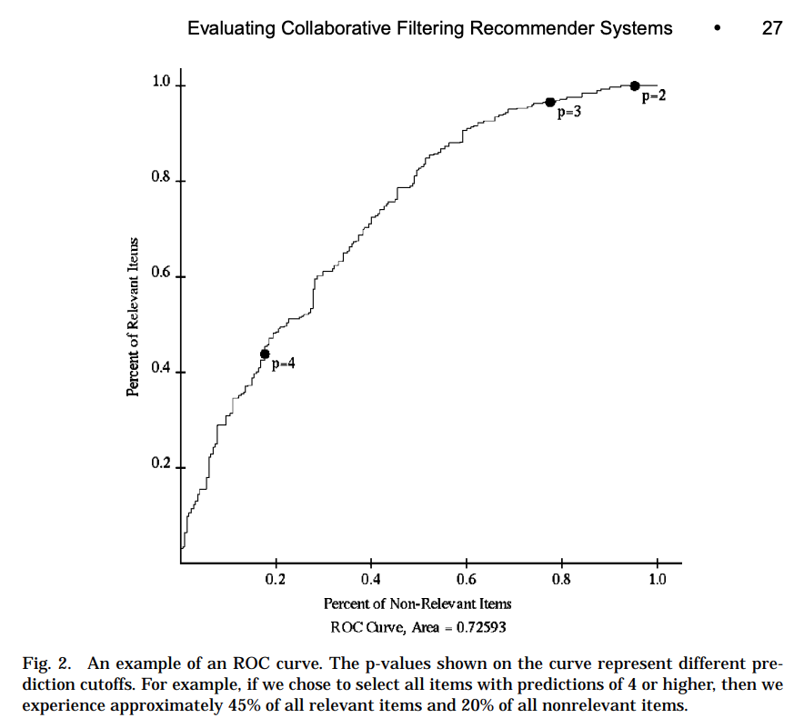
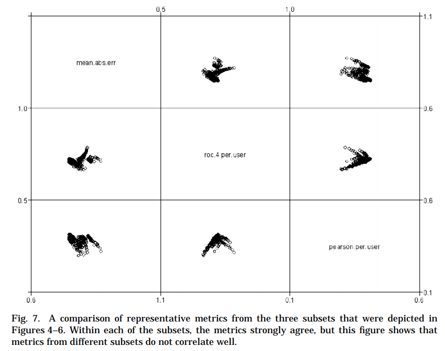

# Evaluationg Collaborative Filtering Recommender Systems の概要

2004年ACMで掲載されたこのサーベイ論文は、レコメンデーションシステムの評価手法をまとめている。
現時点（2019/9/28)で被引用数は5895も多く、課題もよく整理されているので、この分野の研究や業務を行なっているのであれば目を通しておきたい論文だと言える。

残念ながら日本語の解説記事が見当たらなかったので、私なりに概要をまとめてみました。
解釈の間違いなど不備があればコメントしていただけると助かります。

(実は、投稿した論文の査読で「この論文を参照すべき」とご教授いただき、本稿を書くことになりました。)


---

## 論文情報

https://dl.acm.org/citation.cfm?id=963772

## 1章：INTRODUCTION

省略


## 2章：USER TASKS FOR RECOMMENDER SYSTEMS

そもそもレコメンデーションシステムを評価する上で、レコメンドを利用するuserがどのような目的でどのような行動をしているかを整理する必要があります。

userの行動は以下のようなものがあり、それぞれに求められるレコメンデーションの性能が変わります。

- Annotation in Context

　itemに注釈(Annotation)をつけ、どれを読むべきかを判断します。場合によっては除外するメッセージの自動フィルタなどにも転用されます。


- Find Good Items

  itemのランキングリストを表示します。映画コンテンツのレコメンドなどの一般的なレコメンデーションに相当します。

- Find All Good items

  一般的にはitemは非常に多いため、userは効率的に良いものがレコメンドされれば良く、多少の良いitemがリストから漏れていても気にしません。ただし、判例データベースからのレコメンドシステムなどでは別です。このケースでは効率性よりもcoverageが重要になります。

- Recommend Sequence

  例えば楽曲のレコメンデーションであれば、推薦する曲の順番も重要になります。他には論文の推薦システムでもそうです。

- Just Browsing

  レコメンデーションは多くの場合、userが購買を目的としていることを前提としています。しかし、単にitemを眺めるのが楽しいuserも存在します。この場合、精度よりもインターフェースや情報提供が重要になります。

- Find Credible Recommender

  userはレコメンドシステムを信頼しないことがあります。それは彼らがシステムに対して送信する苦情メッセージの多さが証明しています。実用的に調整されたレコメンデーションリストは、userがすでに気に入っているitemを表示しないため、それによってuserからの信頼を得られないかもしれません。どのようにuserが信頼するシステムにするかが課題です。

- Improve Profile

  userがitemを評価することです。

- Express Self

  自己表現あるいは趣味としてitemをレビューするuserが存在します。MovieLensに1000以上の映画レビューを投稿したuserにインタビューをしましたが、彼らはレコメンデーションの性能に貢献しているためにレビューを投稿している訳ではありませんでした。

- Help Others

  Express Selfだけではなく、レビューをすることで他者を助け、それによってコミュニティに貢献できる。そう考えるuserもいます。

- Influence Others

  例えば、ある映画のファンが公開前にもかかわらず高評価レビューを投稿してその映画を応援するような行動です。

## 3章：SELECTING DATA SETS FOR EVALUATION

レコメンデーションの評価を行う際に、検証データの選定は重要です。いくつかのパターンについて紹介します。

### 3.1: Live User Experiments vs. Offline Analyses

ユーザー参加型のオンラインテストと過去データを用いたオフラインテストには違いがあります。

一般的には研究や検証ではオフラインテストが多いです。
オフラインテストには多くの利点がありますが、すでに観測された(user,item)の組み合わせデータしか存在しない中でのテストになります。
よって、userに対してオフラインデータで観測されていないitemを推薦した場合の評価は不可能です。
実施は困難ですが、ユーザー参加型のオンラインテストであればこの問題は解決できます。

### 3.2 Synthesized vs. Natural Data Sets

合成データを用いるかどうかの判断です。
シミュレートされたデータを用いることで、容易にアルゴリズムの評価ができますが、例外的な行動をするuserについての検証にはなりません。
また、生成パターンに適合した特定のアルゴリズムが優位になるため、アルゴリズムの比較として用いるのには問題があります。

### 3.3 Properties of Data Sets

その評価検証に必要なデータの要素を考えるべきでで、それはDomain, Inherent, Sample の三種類があります。

Domainとはそのレコメンデーションが実施される状況に依存するものです。

```
(a) the content topic being recommended/rated and the associated context in which rating/recommendation takes place;
(b) the user tasks supported by the recommender;
(c) the novelty need and the quality need;
(d) the cost/benefit ratio of false/true positives/negatives;
(e) the granularity of true user preferences.
```

Inherentとはuserがitemにratingを行う上で、必然的に考慮しなければならないものです。

```
(a) whether ratings are explicit, implicit, or both;
 *注釈: explicitは1~5点などの明確な満足度rating、explicitは購買などの不明確な満足度rating
(b) the scale on which items are rated;
(c) the dimensions of rating; and
(d) the presence or absence of a timestamp on ratings.
(e) whether the recommendations displayed to the user were recorded; and
(f) the availability of user demographic information or item content information.
(g) the biases involved in data collection.
```

Sample とは一般的にデータセットを評価するために一般的だと考えられる統計的な要素。

```
(a) the density of the ratings set overall, sometimes measured as the averag percentage of items that have been rated per user; since many datasets have uneven popularity distributions, density may be artificially manipulated b including or excluding items;
(b) the number or density of ratings from the users for whom recommendation are being made, which represents the experience of the user in the system a the time of recommendation; ratings from users with significant experienc can be withheld to simulate the condition when they were new users;
an (c) the general size and distribution properties of the data set—some data set have more items than users, though most data sets have many more user than items.
```

### 3.4 Past adn Current Trends in Datasets

利用可能なデータセットの紹介。
この論文が2004年と過去のものなので省略。

## 4章：ACCURACY METRICS

### 4.1 Evaluation of Previously Used Metrics

レコメンデーションシステムの精度指標は大別すると以下の３つになります。

 - "predictive accuracy"
 - "classification accuracy"
 - "rank accuracy"

4.1.1〜4.1.3 ではこのカテゴリについてまとめます。
まずは 4.1.4 はこれらのカテゴリの評価値を同じデータに対して計測し、その相関関係を確認します。

この論文では、カテゴリごとに複数の指標値を紹介していますが、この記事では代表的な一つのみを取り上げます。

#### 4.1.1 Predictive Accuracy Metrics

もっとも代表的なのがratingの平均絶対値誤差(MAE)です。

詳細の開発は不要だと思いますので、省略します。

#### 4.1.2 Classification Accuracy Metrics

適切なitemを推薦できているかの指標です。
ユーザータスクとしては、2章で解説した「Find Good Items」に対応する指標と言えます。

ここで紹介するのはROC曲線を応用したものです（後述のfigure2が具体例です）。
ROC曲線は以下の手順で計算され、総合的な精度指標としてはAUCを用います。

```
(1) Determine how you will identify if an item is relevant or nonrelevant.
まず、レコメンドすべき適切なitemとそうでないitemに分類します。
（例えば、そのuserが評点が5以上をつけたitemなど）

(2) Generate a predicted ranking of items.
そのitemを予測ランキングを生成します。

(3) For each predicted item, in decreasing order of predicted relevance
(start in the graph at the origin)
予測された適切度の降順に並び替え、トップから順番にitemを以下の処理していきます。
(つまり、初めのitemは後述のfigure2の開始地点に相当します)

  (a) If the predicted item is indeed relevant,
  draw the curve one step vertically.
  itemが適切なものであれば、figure2の曲線が上昇します。

  (b) If the predicted item is not relevant,
  draw the curve one step horizontally to the right.
  itemが不適切なものであれば、曲線を水平に描きます。

  (c) If the predicted item has not been rated (i.e., relevance is not known)
  then the item is simply discarded and does not affect the curve
  negatively or positively.
  itemがそのuserから未評価の場合、無視して曲線に影響させません。

```



#### 4.1.3 Rank Accuracy Metrics

Classification Accuracy Metrics はitemごとに適切かどうかのbinaryな指標ではありましたが、より適切なitemがリストの先頭に提案しているかの性能指標がRank Accuracy Metricsです。

このRank Accuracy Metricsの計算では、itemの適切度が非binaryであり順序性が必要となります。

例えば映画に1~5の五段階評価のスコアをつけるデータセットでは、複数のitemが5点をつけられて順序をつけることが出来ません。
このような場合にRank Accuracy Metricsを用いるのは不適切です。

シンプルに、相関係数などの指標を用いることで指標化することが出来ます。


#### 4.1.4 Prediction-Rating Correlation

同じデータセットに対して、これらの別カテゴリの精度指標を適合させ、各userごとのそれぞれの精度指標値の相関分布を確認するとfigure7のようになります。

この図では、カテゴリごとの代表的な指標値を採用して表示しています。

mean.abs.err は Predictive Accuracy Metrics の代表指標です。roc.4.per.user は Classification Accuracy Metrics、person.per.user は Rank Accuracy Metrics です。

この図は、それぞれのカテゴリごとに評価値が無相関であることを示しています。これらの指標値が表す精度は異なる側面を評価していると言えます。



原著論文では同じカテゴリ内では、高い相関性が確認されたことも報告しています。詳細は原著をご確認ください。

### 4.2 Accuracy Metrics--Summary

これまでの結果は指標値のカテゴリ選択によって、まったく違った検証結果になってしまうことが判明しました。

データセットの特徴や検証目的によって、採用すべき指標値を使い分けるべきです。


## 5章：BEYOND ACCURACY

4章では精度について概説しましたが、ここでは精度以外のレコメンデーションの実用性にかかわる指標を概観します。

### 5.1 Coverage

レコメンデーションシステムがuserに推薦するitemの多様性に関わる指標値です。
ユーザーのタスクでいうと"Find All Good Items"や"Annotate In Context"に対応する指標と言えます。

Coverageのもっとも単純な指標は提案するitemの数や割合を計測することです。一般的には何らかの精度指標と同時に計測すべきです。

一方で、Coverageだけで評価する方法もあります。その場合は、userが興味を持っているitemだけで計測することになります。

また、Catalog coverage という概念もあります。
これは推薦されたことのあるitemの割合で、ある一定のuser集合に対する推薦リストから計算します。

一般的にはCatalog coverage と精度指標はトレードオフの関係にあります。

### 5.2 Learning Rate

アルゴリズムによって、実用的な精度に到達す流のに必要なデータ量は変わります。
この学習効率をLearning Rateと呼びます。

Learning Rateにはシステム全体とuserごと、itemごとの３種類があります。

userごとのLearning Rateは、そのuserが行ったratingの回数を変数とする関数として定義されます。
itemsごとのLearning Rateも、ratingされた回数を変数とする関数です。

この指標はcold-start問題に対する性能でもあります。

一般的には、予測の品質（主に精度指標）と評価の数をグラフ化することで検証することが出来ます。

### 5.3 Novelty and Serendipity

いわゆるuserがまだ体験していない新規性のあるitemを提案する性能です。

例えば、楽曲のレコメンドで普段ビートルズを視聴しているuserにビートルズのベストアルバムをレコメンドしたところで、精度は高いですか実用性が高いとは言い切れません。

一方で、wearingen an Sinha [2001]は、ユーザーが既によく知っているアイテムのいくつかの推奨事項を受け取るのが好きであることを発見しました。
また、このような明らか推薦がuserからのシステムに対する信頼を増加させることも報告されています。
さらにuserは身近なitemばかりを購入します。

こららの事実からNovelty,Serendipityの重要性には議論が必要です。
例えば、webの論文検索や無料の楽曲視聴ではより目新しいitemが好まれました。

### 5.4 Confidence

例えば、5段階評価で5点だと予測されたitemと4点のitemでは5点のitemを推薦することになります。
ところが、これは正しいとは限りません。
5点と予測されるitemは、おうおうにして学習データが少なく予測が不安定になっている結果だったりします。
実際に表示を行いより多くのデータを集めれば平均に収束することが多くあります。

予測の信頼性（Confidence）をどのように計測するかも重要な観点です。

Herlocke et al. [2000]の研究では、予測の信頼性をuserに提示することで彼女たちの意思決定に影響を及ぼすことを報告しました。

### 5.5 User Evaluation

ここではユーザーのレコメンドシステムに対する反応を直接評価することについて考えます。（ユーザー観察調査）
ただし、これは定量化することが困難です。

ここでは、代表的な調査や研究を参照しそれぞれの特徴や違いについて整理するだけに留めます。

- Explicit (ask) vs. implicit (observe). インタビューするか観察するべきかの違いです。後者はログ解析も含まれます。

- Laboratory studies vs. field studies. 研究室でのユーザー調査では特定の課題にフォーカスすることができます。フィールド調査ではユーザーの行動パターンや新規課題などを発見できます。ユーザーの"Evaluate Recommender","Express Self"といった行動にアプローチする場合はフィールド調査が適切でしょう。

- Short-term vs. long-term. 特定の調査目的は短期間で観測できる訳ではありません。例えばシステムの利用停止について検証する場合は長期的な調査になります。

これらのユーザー調査は数多く研究されています。その概要については原著論文にて紹介されています。
