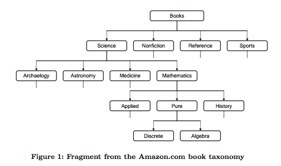
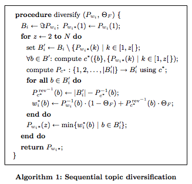
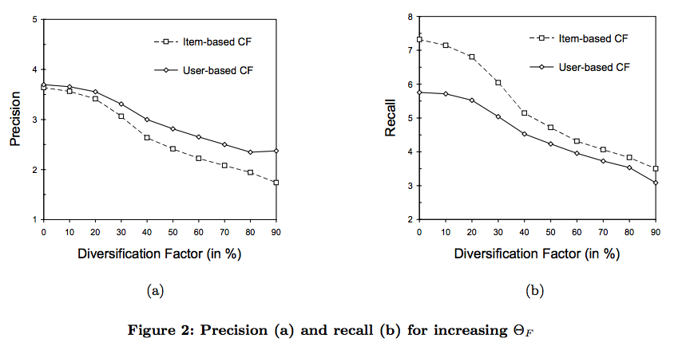
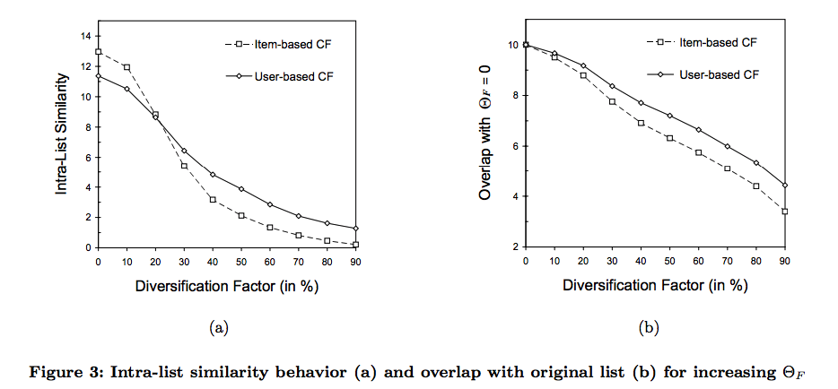
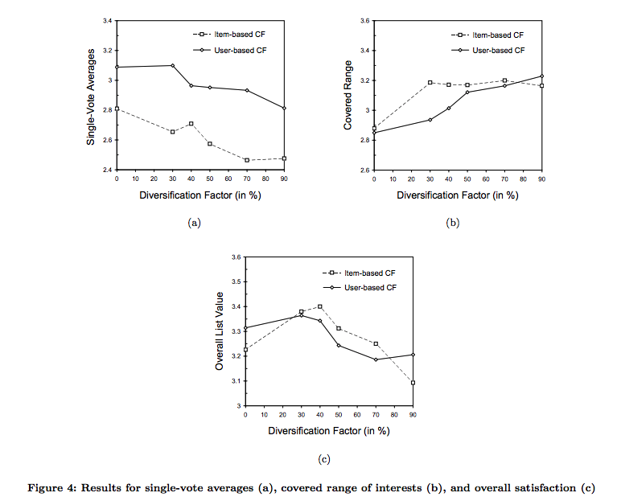

# この論文は？

レコメンデーションシステムの多様性の評価指標である Intera-list Similarity を提案した論文。
推薦リスト内に類似度が低いitemが含まれているほど多様性が高いと定義している。

## 論文の詳細

https://dl.acm.org/citation.cfm?id=1060754

現時点（2019/10/2)で被引用数は1581。

## ご注意

この記事は私が読んだ論文のメモです。
翻訳や解釈に間違いがある可能性がありますのでご注意ください。
もし、間違いを発見された場合はコメントでご教授いただけると助かります。

---

# Improving Recommendation Lists Through Topic Diversification

## ABSTRACT

この論文では、推薦リストの多様性を確保するための手法と、多様性を評価する指標を提案します。
そして、それを用いて書籍の評価データを用いたオフライン検証をし、また2100人の被験者に対するオンライン調査も行いました。

## 1. INTRODUCTION

省略します。

### 1.1 Contributions

- Topic diversification. 多様性と精度を同時に考慮可能な手法を提案しました。この手法はuser-basedとitem-basedの協調フィルタリングに組み込むことができます。

- Intra-list similarity metric. 多様性を考慮した性能指標を提案します。これはuserの満足度を高めるために既存の精度指標を補完します。

- Accuracy versus satisfaction. 「精度は必ずしも満足度に影響しない」は多くの研究で仮説されてきましたが、その証拠はありませんでした。私たちはオフライン検証とオンライン検証を用いてこの課題にアプローチしました。

## 1.2 Organization

省略します。

## 2. ON COLLABORATIVE FILITERING

ここで用いられる数学記号の定義についてまとめます。

- $A={a_1,a_2,...,a_n}$ : user集合
- $B={b_1,b_2,...,b_m}$ : item集合
- $r_i(b_k) → [-1,+1]^{\bot}$ : user $i$ によるitem $k$ のrating. -1~+1の実数をとる。未評価の場合は $\bot$ となる。
- $c(a_i, a_j), c(b_k, b_f) \in [-1, +1]$ : user間あるいはitem間の類似度。通常はピアソン相関係数やコサイン類似度などを用いる。
- $clique(a_i), cliqu(b_k)$ : userあるいはitemの近傍集合。k-neibhborhood集合。
- $w_k(a_i), w_i(b_k)$ : それぞれ、user-based, item-basedに用いられる(user i, item k)の評価値。

item-basedモデルの場合、user $i$ の item $k$ に対する予測rating $w_i(b_k)$ で評価を行う。
その数式は以下の通り。

$$
w_i(b_k) = \frac
  {\sum_{b_e \in B_k^{'}}(c(b_k,b_e) \cdot r_i(b_e))}
  {\sum_{b_e \in B_k^{'}}|c(b_k,b_e)|}
\;\;\;\;...(1)
\\
where\;\;\;\;B_k^{'} := {b_e|b_e \in clique(b_k) \wedge r_i(b_k) \neq \bot}
$$

ちなみに、item-basedモデルは $|A| >> |B|$ の状況でuser-basedよりも高い性能を発揮することが以下の研究で報告されているようです。

```
Sarwar, B., Karypis, G., Konstan, J., and Riedl, J. Itembased collaborative filtering recommendation algorithms. In
Proceedings of the Tenth International World Wide Web
Conference (Hong Kong, China, May 2001).
```

## 3. EVALUATION METRICS

### 3.1 Accuracy Metrics

#### 3.1.1 Predictive Accuracy Metrics

MAE(Mean Absolute Error)やMSE(Mean Squared Error)の紹介なので省略します。

#### 3.1.2 Decision-Support Metrics

Recall, Precision のこの論文での論文定義の解説なので省略します。

### 3.2 Beyond Accuracy

精度だけではuserの満足度を計測できません。
精度以外の指標についてまとめます。

#### 3.2.1 Coverage

推薦するitemの網羅性。

#### 3.2.2 Novelty and Serendipity

推薦するitemの新規性と意外性。

食料品店で明らかに人気商品であるバナナを推薦することは、あまりにも明らかな推薦なので店舗にとっては意味がありません。

### 3.3 Intra-List Similarity

私たちが提案する推薦リスト内の多様性指標です。
多様性の計算には様々な特徴変数を用います。例えば、ジャンルや著者などのitem属性です。
この Intra-List Similarity(ILS)は以下のように定義されます。

$$
ILS(P_{w_i}) = \frac
  {\sum_{b_k \in \S P_{w_i}} \sum_{b_e \in \S P_{w_i}, b_k \neq b_e} c_o(b_k, b_e)}
  {2}
  \;\;\;\;...(5)
$$

- $c_o(b_k, b_e)$ : 任意で定義されたitem間類似度関数です。
- $\S P_{w_i}$ : user $i$ へ表示する全ての top-N 推薦リストに含まれる全てのitem集合。

$ILS(P_{w_i})$ が大きいほど多様性は小さくなります。
また、ILSは推薦リストの順序を考慮しないので、リストを並び替えても多様性指標に変化はありません。

## 4. TOPIC Diversification

推薦リストの多様性を確保するための処理を提案します。

### 4.1 Taxonomy-based Similarity Metric(分類ベースの類似度行列)


- 関数 $c^{*}$ : 恣意的に指定するコンテンツベースの類似度関数です。この検証では taxonomy-driven filter を採用しました。*


```
# taxonomy-driven filter

Ziegler, C.-N., Lausen, G., and Schmidt-Thieme, L.
Taxonomy-driven computation of product recommendations.
In Proceedings of the 2004 ACM CIKM Conference on Information and Knowledge Management (Washington, D.C.,
USA, November 2004), ACM Press, pp. 406–415.

```

例えば、Amazon.comの書籍itemの分類(taxonomies)は Figure1 のようなものです。



### 4.2 Topic Diversification algorithm

Topic Diversification algorithm の疑似コードを、後述するAlgorithm1にまとめました。
この疑似コードに登場する記号の意味は以下の通りです。

- $P_{w_i}$ : topic diversification を考慮しない任意の推薦リストを出力する関数。item $b$ を入力にとり、 $P_{w_i}(b)$ で推薦リストとなる。
- $P_{w_{i*}}$ : topic diversificationを考慮した新しい推薦リストを出力する関数。 $P_{w_i}(b)$ の結果をさらに上書きする処理を行う。
- $z \in [2, N]$ : top-N リストの位置インデックスを表します。
- position $o < z$ in $P_{w_{i*}}$ : for文で順次処理されていく $z$ よりも前のリスト位置インデックスを $o$ としています。
- $\{P_{w_{i*}}(k) | k \in [1,z[\}$ : 推薦リストの位置 $z$ よりも前に出現したitem $k$ を入力とした場合の推薦リストに含まれるitem集合です。
- $P_{c^{*}}^{rev}$ : 全てのitem $b$ を恣意的に採用した分類ベース類似度関数 $c^{*}(b)$ によって降順に並び替えたリスト（配列）。非類似度ランキング。オリジナルの推薦リストである $P_{w_i}(b)$ と結合することで最終出力である $P_{w_{i*}}(b)$ を生成する。
- Factor $\Theta_F \in [0,1]$ : $P_{c^{*}}^{rev}$ の影響度を定義する係数。*

注意点として、Algorithm1を実行する上で、オリジナルの推薦リスト $P_{w_i}$ は最終出力である top-N リストのNよりも十分に大きなリストである必要があります。



### 4.3 Recommendation Dependency

Algorithm1のモデルでは、オリジナルの推薦リストの $o$ 番目のitem(つまり $P_{w_i}(o)$ )が $p$ 番目のitem(つまり $P_{w_i}(p)$ )に影響を与えて最終的な推薦リスト位置が決まります。( $o<p$ の時)

これは通常のレコメンデーションアルゴリズムにはない特徴です。


### 4.4 Osmotic Pressure Analogy

Algorithm1のモデルは浸透圧膜のような効果があります。
すなわち、すでに処理済みのitemが増えるたびに濃度が変化し、次の透過度が変化するのです。

## 5. EMPIRICAL ANALYSIS

実際に書籍データセットに適応した結果について報告します。
Algorithm1 の調整パラメータ $\Theta_F$ は $\{0, 0.1, 0.2, ..., 0.9\}$ の範囲で結果をまとめます。

### 5.1 Dataset Design

BookCrossing (http://www.bookcrossing.com) のデータを用いました。
このデータは独自にクローリングして収集したものです。

#### 5.1.1 Data Collection

省略します。

#### 5.1.2 Condensation Steps

省略します。

### 5.2 Offline Experiments

上述のデータについて、オフライン検証を行いました。

#### 5.2.1 Evaluation Framework Setup

省略します。

#### 5.2.2 Result Analysis

省略します。


##### 5.2.2.1 Precision and Recall



仮説通りに、x軸の $\Theta_F$ の増加に従い、Precision/Recall 共に悪化した。

##### 5.2.2.2 Intra-List Similarity



Intra-List Similarity は多様性が増加するほどその値は現象する。

figure3(a)によると、x軸の $\Theta_F$ の増加に従い多様性が改善している。

##### 5.2.2.3 Original List Overlap

figure3(b)を参照。

##### 5.2.2.4 Conclusion

省略します。

### 5.3 Online Experiments

オフライン調査に用いたWebサイト(http://www.bookcrossing.com)の利用者にメールを送り、我々のオンライン調査に参加してもらいました。
アンケートURLを送りそこに回答を入力をする形式です。
最終的に2125名のユーザーから回答を得ることができました。

#### 5.3.1 Survey Outline and Setup

このアンケート調査の設定について紹介します。

まずWeb画面にユーザー自身がratingした履歴を表示し、最後にtop-10の推薦リストを表示、そのあとにいくつかの質問を尋ねます。

表示された本ごとに1~5点のratingをつけることができますが、1~4が'not much'~'very much'であり、5点はすでに読んだことがある本です。
アンケートの収集率を重視したため、全ての推薦本に回答する必要はないようにしました。
よって、中立値(Neutral value)は回答のなしとします。

回答結果を提出する前に、推薦リスト全体についてのいくつかの質問への回答を必須としました。
そのほとんどが無意味な質問ですが、本当に知りたい質問を隠しています。
これは我々の意図を読み取ってしまうことによるバイアスを抑制するためです。

アンケートuserに表示される推薦リストは一つで、12カテゴリのリストから選ばれます。
user-based CFとitem-baseCFとそれぞれの $\Theta_F \in \{0,0.3,0.4,0.5,0.7,0.9\}$ からです。
推薦リストの割り当てはラウンドロビン方式で行なったので、リストタイプごとの割り当てuserの数は均一になります。

#### 5.3.2 Result Analysis

オンライン調査の分析には３つの側面に注目しました。

- リストタイプごとの平均rating。
- userが推薦リストが自身の読書の興味範囲をどの程度反映しているか。
- 推薦リストの本に入力してもらったratingの予測精度

平均値を計算する上での有意差はANOVAを採用し、特に明記がない限りはp=0.05です。

#### 5.3.2.1 Single-Vote Averages

結果は、下記に記載するfigure4(a)です。

多様性を増加させる $\Theta_F$ が高いほどに、平均的なratingが低下しています。
つまり、仮説通りに topic diversification は精度に対して負の影響を与えています。

#### 5.3.2.2 Coverage Range

userが回答した興味のカバー率(user-perceived interest coverage)の分布結果は、下記に記載するfigure4(b)です。

$\Theta_F$ が高いほどに、増加傾向にありますが、オフライン調査で用いた intra-list similarity ほどの顕著な傾向ではありませんでした。




#### 5.3.2.3 Overall List value

省略します。

### 5.4 Multiple Linear Regression

$\Theta_F$ の single-vote average と user-perceived interest coverage への影響を一次の回帰式と二次の回帰式でその回帰係数を確認した。
結果は十分に有意な係数となった。

省略します。

### 5.5 Limitations

省略します。

## 6. RELATED WORK

省略します。

## 7. CONCLUSION

省略します。
