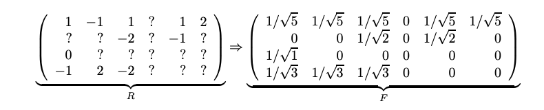
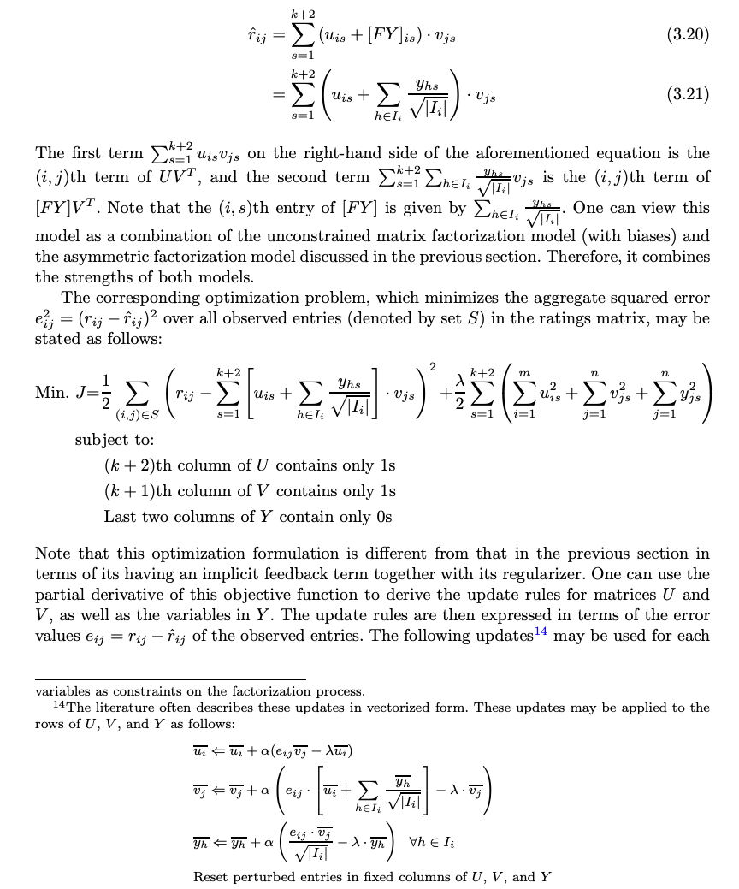
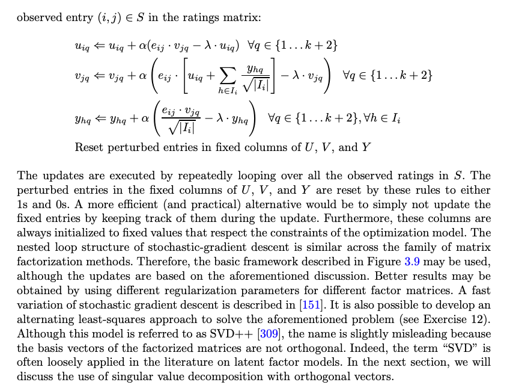
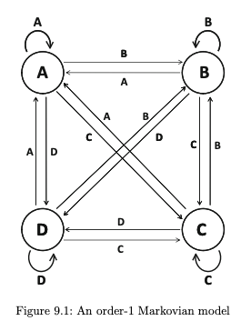
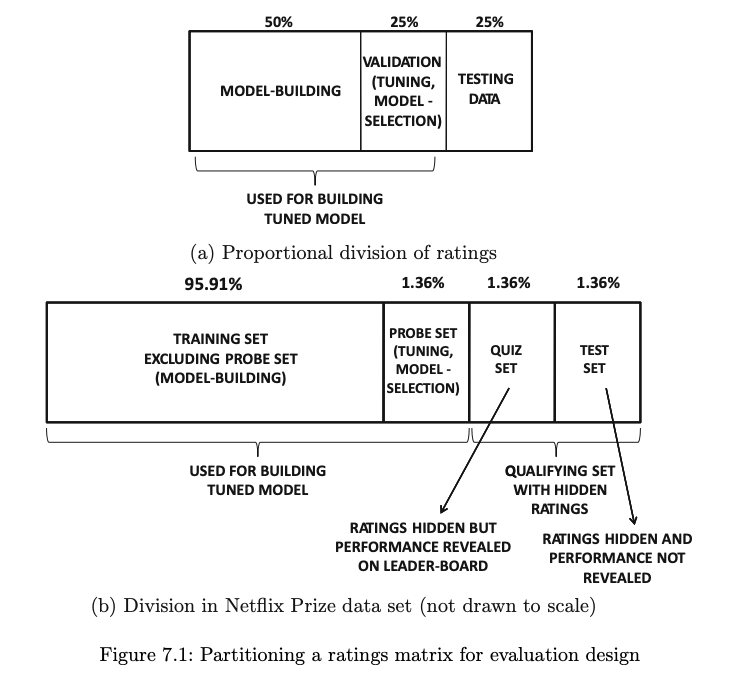
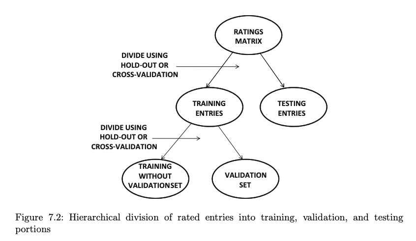
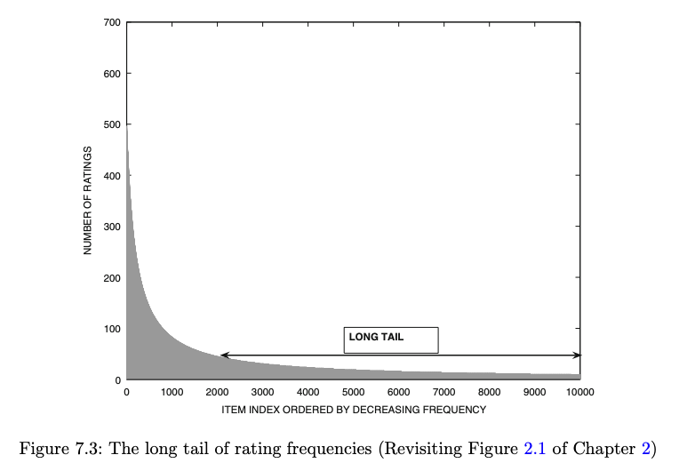
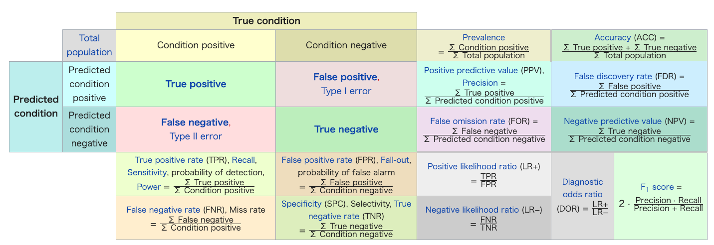
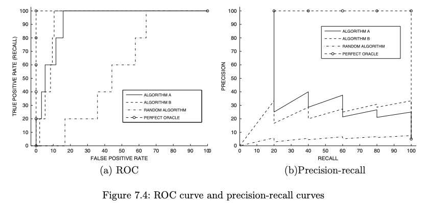
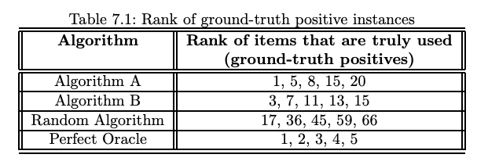

# self-study_Recommender_Systems


このドキュメントは、springer の notebook　である ''Recommender Systems'' を私の研究に関係する箇所だけを読み、そのメモをとったものです。

## ''Recommender Systems'' の情報

* URL:
 https://link.springer.com/content/pdf/10.1007/978-3-319-29659-3.pdf

* BibTex:
```
@book{aggarwal2016recommender,
  title={Recommender systems},
  author={Aggarwal, Charu C and others},
  year={2016},
  publisher={Springer}
}
```

* 被引用数：
　381 (2019/06/30 時点)

* 本notebookを選んだ理由：
　
 recommender systemの技術は日々更新されており、数々のsurveyやnotebookがこれまでの研究経緯をまとめている。
 多く引用されたのsurvey研究として、2002年に発表された[1]があり、その引用数は4023回である。
本textbookは[1]よりも引用数は少ないが不足しているわけではなく、2016年発行であり最新の研究もカバーしている。
よって、執筆する論文の論拠とする上で、適切であると判断した。

[1] https://link.springer.com/article/10.1023/A:1021240730564


## ''Recommender Systems''を読む目的の整理

私の目標は、「論文を執筆すること」である。

本notebookを全て読むことは有意義だが、目標達成を優先して部分的に読むことにした。
特に、私の研究課題（新アイテムIDの提案手法,Cold-Start, Diversity問題）に関係する箇所を中心に確認していく。

よって、以下の章を順番に読み進めていく。


- 1.2 Goals of Recommender Systems
- 1.4.2 Time-Sensitive Recommender System
- 1.5.1 The Cold-Start Problem in Recommender System
- 7 Evaluating Recommender Systems
- 13.3 Multi-Armed Bandit Algorithms

1.2は、 この分野で共通認識として価値があると認識されているものを再確認するため。

1.4.2は、新アイテムIDの提案手法から、時系列データと取り扱いの一般を把握するため。

1.5.1は、新アイテムIDの提案手法から、一般課題となるCold-Start問題の既存研究を把握するため。

7は、レコメンデーションの評価手法について再確認するため。

13.3は、アイテムIDの評価観点から、私個人がBanditアルゴリズムの応用が有効であると仮説しているため。


以降より、本textbookの内部を要約する。
---

# 1.2 Goals of Recommender Systems

Recommender Systemには以下の二種類の問題がある。

- Prediction version of problem

> ユーザーとアイテムの組み合わせごとにレビュースコアを予測するもの。

- Ranking version of Problem

> スコアを予測する必要はなく、top-k itemリストを最適化するもの。


本notebookでは全体を通して、top-k recommendation problemについて取り扱う。

また、ビジネスとしての目的として以下がある。

1. Relevance:妥当性

> あまりにも当然だが表示するアイテムがユーザーに妥当であるべきだ。これにあえて言及するには訳がある。その詳細は、以降の別の目的でのべる。

2. Novelty:新規性

> ユーザーがまだ見たことのないアイテムを表示する場合に、レコメンデーションは新の価値を発揮する。例えば、好みのジャンルの人気映画を提案してもNoveltyは低い。人気商品を繰り返して表示することで、販売の多様性が減少することも報告されている[203]。

3. Serendipity:好ましい初めての機会提供

> [229]の言及された概念で、予想外のアイテムを提案すること。SerendipityはNoveltyと違い、単純に見たことがないアイテムだけでなく、ユーザーを驚かすものだ。同じタイプのアイテムばかり利用しているユーザーに対して、全く別のタイプのアイテムを提案するときに重視される概念である。

>例えば、インド料理屋が近所に新しくオープンした時に、普段、他のインド料理屋を利用しているユーザーに提案するのはNoveltyである。エチオピア料理屋を普段利用している人に、このインド料理屋を提案するのがSeredipityである。

>Seredipityの改善は、販売アイテムの多様性を増加させ、また新しいトレンドをユーザーに紹介する作用がある。これはより中長期的で戦略的な視点にたった目的である。

>一方で、短期的な目的とのトレードオフの関係にある。

4. Increasing recommendation diversity: 提案の多様性の向上

> top-k リスト内のアイテムが全て同じようなものであれば、提案内容の全てがユーザーに受け入れられない危険性がある。リスト内のアイテムに違いがあると、ユーザーが好むアイテムが含まれるチャンスが増える。同じようなアイテムを繰り返し表示するよりも、より多くの利益がある。

これらの目的には、いずれもユーザーと市場の側面(perspective of user and merchant)をもつ。適切なアイテムリストの提案を行うWebサイトは、Amazonのようにユーザーのロイヤリティを高めるだろう。

このような目的は、ユーザーにアイテムを提案するという枠組みの範囲内で有効である。FaceBookなどのSNS内でのレコメンデーションでは、また違った目的が必要になるであろう。

レコメンデーションには様々な問題があることを注意すべきだ。


## GroupLens Recommender System

GroupLensはレコメンデーションシステムのパイオニアで、Usenet newsのレコメンデーションのプロトタイプの研究から発足した。

Collaborative Filteringなどの初期手法を考案したのも彼らである。

またMovieLensのデータセットを公開し研究に貢献している[688]。

## Amazon.com Recommender System

レコメンデーションの商用利用について研究してきたのがAmazonである。その初期のアルゴリズムについては[360]の研究で議論されている。

Amazonのレコメンデーションは、明示的に入力されたレーティング情報と、購買行動と、閲覧行動に基づいている。

購買や閲覧の行動は、implicit rating とみなせる。これに対してレビュースコアの入力は、explicit ratingである。例えば、セクション3.6.4.6で紹介するいくつかのモデルは、このexplicitとimplicitのfeedbackをレコメンデーションに統合ように設計されている。

## Netflix Movie Reccomender System

Netflix のレコメンデーションにおける素晴らしい研究成果は、レコメンデーションされたアイテムの説明(explanations)である。
これは提案するアイテムに説明をつけ、ユーザーに見るべきかどうかの判断を補助するものだ。
これはアルゴリズムがどうやってそのアイテムを見つけてきた理由をユーザーに提供する。
これはユーザーへの体験に改善をもたらし、そのロイヤリティや継続率を改善した。

また、The Netflix Prizeというコンテストを実施し、そこで提案されたlatent factor modelは非常に有名になった。このPrizeの多大なレコメンデーションへの貢献は[71, 373]の研究でまとめられている。


## Google News Personalization System

Google News Personalization System[697]は、過去のニュースのクリック率からニュース記事を提案する。
クリックがポジティブなレーティングと代替的に見なすことができる。
この種のレーティングをunary ratings(単一レーティング)と呼ぶ。
なぜこのように呼ぶかというと、ユーザーが好ましいと思っている情報はあるが、嫌いであるという情報はないからである。
さらに言えば、ユーザーの行動からinferredされた、implicitなレーティングであると言える。

上記のような前提に基づいて、Collaborative Filteringの手法が応用可能である。
[175]の研究で、Google NewsにおけるCFが紹介されている。より詳しい情報については、本notebookのセクション13.8.1.2で紹介する。

## Facebook Friend Reccomendations

SNSは友達である可能性の高いユーザーをレコメンデーションすることがある。
その具体例がFacebook[691]である。
このタイプのレコメンデーションは、製品のそれとは違い、ソーシャルネットワークの接続数を増やすことを目的としている。

この問題は'link prediction'と、social networkの分析分野で呼ばれている。
そのため、原理やアルゴリズムが完全に異なっている。

本notebookでは10章でその詳細を紹介する。
また、SNSは広告収入が基本であり、その広告配信システムであるcomputational advertising to recommender system technology は13章で議論する。


---
# 1.4 Domain-Specific Challenges in Recommender System > 1.4.2 Time-Sensitive Recommender systems

映画のレコメンデーションでは、その映画のリリース日と数年後のレーティングが違うことが知れらている。
このケースでは、一時的な情報を用いてレコメンデーションを行うことは重要であり、その方法は以下のパターンがある。

1. アイテムのレーティングが時間経過で変化する背景には、コミュニティーの態度やユーザーの志向も変化することが考えられる。時間経過ごとにユーザーの興味や嗜好や流行の変化を時間と共に変化していく。

2. 特定の日付情報がレーティングに影響を与えているとする。例えば曜日や月、季節などである。ファッションでイメージしやすいだろう。

パターン1は、Collaborative Filteringのモデルに変数導入することで実現する。
パターン2は、Context-based recommender systemsの一つの実装である。

Temporal recommender systems はスパース問題についてのチャレンジでもある。

他の一般的な設定としては、Web click-streams をフィードバックすることが考えられる。
Webのユーザー行動では、様々なログが利用できる。
このケースでは、click行動シークエンスを Markovモデルで分析することが有効だ。
これらの詳細については、9章で紹介する。


# Chapter 9: Time- and Location-Sensitive Recommender Systems

## 9.1 Introduction

TimeやLocationのようなtemporalデータが予測に有効であることが知られている[310]。
他にもclickstreamsやユーザーの行動データも本質的にtemporalである。
これらのデータのレコメンデーションへの実装には2つのパターンがある。

1. Explicit ratings: データを率直にレーティングに紐付ける。

2. Implicit feedback: このシナリオはユーザーの行動に対応する。例えば、アイテムの購買やクリックなどである。これらの履歴シークエンスは、次の行動予測に用いられる。

これらの情報のレコメンデーションへの導入には、様々な困難があり[310]でもtemporary dataを制限し、計測方法(calibraed way)も工夫していた。

一方で、implicit feedbackモデルは、シークエンス情報を用いることで多彩な表現力がある。

（中略）

time-SVD++ というモデルを例にあげる。
これは現状の temporal recommendation の state-of-the-art である。
このモデルの特徴は　future trends を捕まえることができることである。
一方で、recency(最近の)を捕まえることができない。

clickstream型のデータでは、素直なレーティング情報のない行動シークエンスである。
こういったデータを implicit feedback data sets と呼ぶ。
この場合は、レーティングを前提としたモデルではなく、Markovian model や sequential pattern-mining methods などが用いられる。
こういった手法は、webマイニングの技術で一般的に用いられているものだ。

location-sensitive recommender system についても触れておこう。。。

（省略）

セクション9.2では、時系列レーティング情報を用いる手法を紹介する。
ここには3つのアプローチがある。recency-based models, periodic models, more complex parameterized modelsである。
最後のモデルに該当する time-SVD++ は、現状の state-of-the art である。
8章で紹介済みの context-based model を応用した手法についても議論した。

セクション9.3では、別のmodels を拡張し、ユーザーのclicksのような選択行動のケースに適応することを議論する。例えば、Markovian model のclick-streamsへの適応などはこのセクションで扱う。

Location-aware recommender system についてはセクション9.4で扱う。

セクション9.5はサマライズである。


## 9.2 Temporal Collaborative Filtering

1. Recency-based models: いくつかのモデルでは、最近のレーティングが古いレーティングよりも重要だと考える。つまり、window-based や decay-based のモデルがより精度が高くなる。基本的な考え方は、最近のレーティングが予測により大きな影響を与える、ということである。

2. Periodic context-based models: 曜日や月、季節などの periodic な情報をcontext-based model に応用する。ファッションのレコメンデーションなどでは特に重要になる[567]。映画のレコメンデーションでも、クリスマスやオスカーの時期が重要になることが知られている[100]。

3. Models that explicitly use time as an indepet variable: 最新の手法で、time-SVD++法に言及すると、時間を独立した変数として使う。ユーザー、アイテムともに固有の傾向を扱い、temporal variationsを操作する。より洗練された方法である。


### 9.2.1 Recency-Based Models

古いレーティングよりも新しいレーティングの影響をより大きく扱う手法。decay-based と window-based の二つかある。window-based は decay-based の一種で、一定時間より過去のデータの重みを0とする手法と言える。

#### 9.2.1.1 Decay-Based Methods

以下の記号は以下のように定義する。

- $u$ : ユーザーID
- $j$ : アイテムID
- $t_{uj}$ : ユーザーとアイテムの組み合わせが観測された時間
- $m$ : ユーザーの総数
- $n$ : アイテムの総数
- matrix $R$ : $m \times n$ の観測されたrating行列
- $t_f$ : 未来の時間。主に予測時の引数となる。
- $w_{uj}(t_f)$ : その予測時間から見た、過去に発生したその組み合わせのratingに乗ずる重み。一般的には、$t_f - t_{uj}$ が大きくなるほどこの重みは小さくなる。

- $\lambda$ : これは時間差の任意の調整係数として機能する。これが大きいほど、古いratingの影響が小さくなる。

[185]が提案したdecay functionは下記となる。
この考え方は、neighborhood-based のレコメンデーション手法に適応された。

$$
w_{uj}(t_f) = exp[- \lambda (t_f - t_{uj})] \;\;...(9.1)
$$

（以下、通常の user-based k-nn CF法に上記重みを類似度へ導入する解説なので、省略。）

[186]の研究は、[185]の手法を改善した。
これはユーザーごとに時間割引を学習するモデルである。（詳細は省略）

これらの時間差によって重みを最適化するアプローチは、他の手法と組み合わせることが容易である。
セッション6.5.2.1で紹介したように、matrix factorization model とも組み合わせることが可能である。（確認すると、潜在ベクトルの更新時に、古いデータほど更新幅が小さくなるように重みを導入する方法でした）

#### 9.2.1.2 Window-Based Methods

この手法は以下の2つのパターンがある。

1. $t_f - t_{ij}$ が特定の閾値よりも多い場合は、そのratingを破棄する。[131]で　k-nn ベースであるCollaborative Filtering では全てのratingを用いた方が良いとされ、k-nnによるneibhorsの選出に用いる類似度行列の計算では過去のratingsも全て用いるが、最終的な予測ratingを出力する際のみ過去のratingは無視する。

2. 特定の時期に活性化するアイテムがあるケースで利用されるアプローチがある。この場合は、アイテムごとにwindowを最適化する。[131]では、閾値は「過去x日以内のy月のratingのみを参照する」としていた。なのでこれは、window-based と periodic informationの混合型と言える。この手法は、 time-periodic biased k-NN アプローチと呼ばれている。

時系列以外のtemporal dataを用いている。例えば、[595]では、映画のproduction time をベースにしたwindow-basedモデルを提案している。注意点としては、この研究では十分に古い製作年の映画を、最近のratingも含めて除外していることだ。これによってrating行列の次元が十分に小さくなる利点もあるが、応用には注意を要する。

#### 9.2.2 Handling Periodic Context

cotextual-modelを応用して、日付の月や曜日やクリスマスなどのイベントを学習させるアプローチではあるが、[6]の研究で提案され、それについて8章で取り上げた。

##### 9.2.2.1 Pre-Filtering and Post-Filtering

2種類のfiltering methodがある。それぞれの詳細はセクション8.3, 8.4で述べた。ここではそのtemporal recommender systemsとしての応用について簡単にのべる。

pre-filtering では、レコメンデーションの計算処理をする際に、ある特定のtarget time(contextなど)に関係しないratingデータを除外することだ。
これにより、学習された結果は自然と、そのtarget time（だけ）の特徴を捉えたものとなる。

このアプローチでは、contextual microfiles[61]を使った方法が興味深い。contextual microfiles とはcontextによってセグメントを分けられたratingである。
例えば、セグメントには{Morning, Evening},{WeekDay, Weekend}などがある。それぞれのcontextで、別々のモデルが学習を行う。
このfilteringの後に、あらゆるnon-contextual methodを用いて、セグメントごとに分けられたデータを学習する。
pre-filtering アプローチでは、オリジナルのデータよりもさらにスパースなデータになることがチャレンジとなる。
そのため、日付ごとのセグメントなどの設定は現実的ではなく、時間帯のセグメントにしても、{1時,2時,,,24時}よりも{1-6時,,,19時-24時}などが好まれる。

post-filtering では、non-contextual methodsを全データについて学習した後に、contextに基づいた調整を加える。
ゆえに、このアプローチでは以下の2段階の処理がある。

1. temporal context を無視して、通常のレコメンデーションを全データに対して適応する。

2. それによって生成されたレコメンデーション結果リストを、temporal contextに基づいて調整する(post-processing step)。リストの順序の変更、あるいはtemporal contextに関連しないアイテムIDをリストから除外する、など。

よって、post-filteringでは、2の処理方法が重要になる。

（中略）

[471]はシンプルなスキームを提案した。それは、pre-filtered dataで特定の映画を視聴したユーザーのneighborsを、post-filteringの2の処理で用いる順序調整に用いる重み(contextual relevance weight)

（省略）

#### 9.2.2.2 Direct incorporation of Temporal Context

pre-filtering, post-filtering のアプローチは、filteringにより2-dimentsional model の問題に変換し、それがゆえに、既存のnon-contextual モデルを応用してcontextual temporal dataを処理できるメリットがあった。

一方で、3-dimmensional(user,item,context)を同時に扱うアプローチもある。
例えば、user-based neighborhood スキームを用い、あらかじめユーザーがもつcontextual attributes を用いた類似度を計算する。
もし二人のユーザーが週末に同じアイテムに同じratingを入力した場合、この二人はより類似度が高いと考えるべきだ。
このような類似度の再計算を、レコメンデーションのプロセスに組み込めば良い。
これは、regressionとlatent-factor modelを改修してtemporal context を直接導入することが可能だ。
このようなアプローチは一般的にはcontext-based scenario で行われる。
それゆえ、8章のcontext-based methods としてまとめている。セクション8.5を確認してほしい。

#### 9.2.3 Modeling Ratings as a Function of Time

ここでは、temporal factor models であり、現時点で state-of-the-art だと思われる　time-SVD++ を紹介する。

この手法は、long-term trends と transient and noisy trends(一時的で雑多な傾向) に分けることができる。この手法はこの分野の数々研究の集大成でもある。

##### 9.2.3.1 The Time-SVD++ Model

これはSVD++modelのtemporal拡張である。
以降に進む前に、3.6.4.6 を確認すべきである。

↓↓↓なので、3.6.4.6 を要約↓↓↓

---
##### 3.6.4.6 Incorporating Implicit feedback

implicit feedback では購買行動や閲覧履歴などの[0,1]のデータを扱うことになる。
[184]の研究では音楽領域において、ある問題を指摘している。

"
ユーザーは聞いた曲を評価し、そして期待する曲を聞き、一方で嫌いなジャンルを避ける。それゆえ、低いratingになってしまった曲のほとんどが、ユーザーが自発的にratingしたものではない。
ユーザーがランダムで曲を視聴することはめったにないので、計測されたデータが何らかの乱数分布から得られたものと仮定はできない。
"

asymmetric(非対称) factor models　と SVD++ はimplicit feedback のために提案されました。
これらのアルゴリズムでは異なる二つのitem factor matrix $V,Y$ を用います。$X$はexplicit feedback(ユーザーのアイテムrating入力)に対応し、$Y$はimplicit feedback(ユーザーのclick-streamsなどの行動データ)に対応します。
ユーザーの latent factors は、$Y$(implicit item lateten factor matrix)の線形結合で生成されます。
このアイデアはユーザーのfactorsはユーザーの嗜好に対応しているというもので、ユーザーの嗜好はrateすると選んだアイテムに現れている、ということでもあります。
もっともシンプルなasymmetric factor models では、rateされたitemの(implicitな)factorベクトルの線形結合を、ユーザーのfactorを作るために使うことだ。
この結果、私たちはもはや独立したユーザーのfactorsを持たなくなる。
その代わりに、独立したアイテムのfactors(explicit, implicit)を得る。
そして、ユーザーのfactorはimplicit item factorsの線形結合で導出されるようになる。

多くの手法がこのアプローチを議論[311]してきたが、そのオリジナルなアイデアはPaterek[473]が提唱したものだ。
SVD++モデルは、このasymmetric アプローチと explicit user factors と 既存の factorization framework を結合した。
ゆえに、the asymmetric approach はSVD++の前身だと見なすことができる。
なので、はじめに　asymmetric model を簡単に紹介しよう。

###### Asymmetric Factor Models[184,311,473,309]:

- $m$ : ユーザーの総数
- $n$ : アイテムの総数
- $F=[f_{ij}]$:$(m \times n)$: clickstreams などのユーザーの行動履歴からアイテムの選択データを生成したもの。(implicit feedback matrix)。
- $R=[r_{ij}]$:$(m \times n)$: rating行列。(explicit feedback matrix)
- $U$:$(m \times k)$: explicit user-factor matrix. 事前にmeanc-centering 変換したRに、さらに3.6.4.5で説明されたbiasを導入をしたものをSVDでfactorizeしたもの。user側のfactor。
- $V$:$(m \times k)$: explicit item-factor matrix. 事前にmeanc-centering 変換したRに、さらに3.6.4.5で説明されたbiasを導入をしたものをSVDでfactorizeしたもの。item側のfactor。

もし、$r_{ij}$が計測された時、$f_{ij}=1$とする。そうでない場合は$f_{ij}=0$として$F$を生成する。
(内田コメント：本来clickstreamsなどから生成するはずのFをこのように生成する理由は後半で語られる)
さらに$F$は、行方向(ユーザー単位)にL2-normが1になるように要素をスケーリングする。
つまり、$I_i$がユーザーiがrateingしたアイテムのインデックスベクトル（すなわち、標準化する前の $F_{i*}$ ベクトル）だった時、それぞれの行を $1/\sqrt{|I_i|}$ と変換する。

図で表すと以下のようになる。



- $Y=[y_{ij}]$ : $(n \times k)$ : implicit item-factor matrix。行列Fは線型結合の重みを計算することで、user-factor mtrix を生成する。このYはアイテムごとのimplicitデータの特徴をencodeしたものだ。つまり、$|y_{ij}|$ が大きいということは、アイテムiがratingされるかどうかという行動について（実際のratingの高低は無関係）、j番目の潜在因子が強いということだ。

このように計算されたfactorsはユーザーとアイテムのpreferencesと解釈できる。
特に行列の積$FY$は、$m \times k$ の次元となり、user-factor 行列となる。
そして、その(user-specifig)rowとimplicit item factor との線型結合は、ユーザーがratingを行ったかどうかに依存している。

行列FYは、user-factor行列Uの代わりにも使われる。
計測されたrating行列Rは、factorで近似すると$R \approx [FY]V^T$ となる。
ここでVは$n \times k$のexplicit item-factor matrixだ。よって $[FV]$ をexplict user-factor matrixと解釈することができる。

このモデルに対して、biasを導入することも可能である。
Rをmean-centeringを行い、YとVに2つの追加カラムを導入する。これについては、セクション3.6.4.5で紹介する。

このシンプルなアプローチの基本的な考え方は、同じitemにratingしたユーザーは、そのratingのスコアの良し悪しに関わらず、類似するユーザーとしてfactorを計算することだ。
注目すべきは$n < m$ である場合に行列Y($n \times k$)はuser-factor 行列U($m \times k$)よりもパラメータが少ないことだ。
また、このアプローチは購買行動やclickstreemsなどの他のimplicit feedback にも応用できる。

通常のexplicit feedback しか用いない手法と比べて、このアプローチは explicit, implicit両方を扱うことでパフォーマンスが高くなる。
さらに、ユーザーの変数化が不要になり、学習データに存在しないユーザーに予測可能である。（内田の補足：$R \approx [FY]V^T$ から予測にはF,Y,Vが必要である。このうちFのみがユーザーの情報を有する行列($m \times n$)である。しかし、これはimplicitの行列なので、新規ユーザーは全ての要素を0とすれば良い）一方で、新しいアイテムには不可能である。

item-based parametrization of asymmetric factor model も explainability(説明力)のメリットもある。
factorization $[FY]V^T$ を $F[YV^T]$ と表記し直すことで、 $[YV^T]$ を item-to-item の関係行列 $[YV^T]_{ij}$ と見直すことが可能だ。_
これを user-to-item の関係行列であるFと掛け合わせることで、user-to-item の予測を実現していると解釈できる。
それゆえ、以下のような説明が可能になる。
過去に利用/ratingされたアイテムが、予測式 $[FY]V^T$　に影響を与えている。
このような説明力は、item-centric modelsの特徴である。

###### SVD++ [309]:

Asymmetric Factor Modelsでは、user-factors をスコアを無視してどのアイテムをratingをしたかどうかだけで生成した。これにより、同じアイテムをratingしたユーザーは、同じrating予測を受け取ることになる。

SVD++では、微妙に異なるアプローチを取る。
Asymmetric Factor Modelsでは、 $U=FY$ であり、implicit user-factor matrix であるFYは,explicit user-factor matrixであるUを生成するために用いたが、SVD++ではFYをUを調整するために用いる。
つまり以下のようなモデルになる。

$$
R = (U + FY)V^T = (U)V^T + (FY)V^T
$$

上記の式のうち、 $(FY)V^T$ がimplicit feedback component である。
SVD++はこれにより、パラメータが増え、スパースな状態でのover fitting の危険性が高くなる。
implicit feedback component の計算にはasymmetric factor modelと同じものが使える。
もちろん、購買履歴やclickstreamsを適応しても良い。

userやitemのbias導入については、3.6.4.5の手続きと同じである。
ratign matrix R をglobal mean $\mu$ でmean-centered around を行う。
そして、3.6.4.5にしたがって、二つのカラムを追加してbiasを設定する。
これによって、Yを($n \times (k+2)$)の行列とし、後の追加された2つのカラムには0が入る。
0としたのは、biasを構成する要素は、Uに追加された2つのカラムで十分であるからだ。
Yの追加カラムを0にしたのは、計算上の理由で次元を揃える必要があるためだ。
このような状況で、以下の式によってrating スコア $\hat{r}_{ij}$ を求める。

(以下より、原文のママ)





---

##### ↓↓↓9.2.3.1 The Time-SVD++ Model[310] に戻る↓↓↓

Time-SVD++ modelはSVD++を拡張してtemporal dataにも対応させたものだ。

SVD++ modelでは、平均が0のrating matrixであるとして処理してきた。全てのratingスコアを $\mu$ として、$\mu != 0$ だったとしてもcenteredしてしまえば良い。

3.6.4.5を復習すると、factor model は下記の数式である。

$$\hat{r}_{ij} = o_i + p_j + \sum{u_{is} · v_{js}} \;\; …(9.5)
$$

- $\mu$ [float]: global mean rating score.
- $o_i$ [float]: bias variable for user i.
- $p_j$ [float]: bias variable for item j.

implicit feedbackを導入すると下記のようになる。

$$\hat{r}_{ij} = o_i + p_j + \sum_{s=1}^{k}({u_{is} + \sum_{h \in I_i} \frac{y_{hs}}{\sqrt{|I_i|}}}) · v_{js} \;\; …(9.6)
$$

- $Y$ [matrix($n \times k$)]: implicit feedback item-factor.
- $I_i$ [set of items]: set of items rated by user i.  

式(9.6)の $\sum_{h \in I_i} \frac{y_{hs}}{\sqrt{|I_i|}}$ は、式(9.5)の $u_{is}$ に対応する。
いずれもユーザーiのfactorである。

ちなみに、式(9.6)は式(3.21)にも対応しているが、ここではbias項を行列に含めず明示している点が異なる。

式(9.6)のSVD++をベースに、time-SVD++を構築する。具体的には、$o_i, p_j, u_{is} → o_i(t),p_j(t),u_{is}(t)$ と、パラメータを時間を変数にとる関数として扱う。よって、以下のモデルとなる。

$$\hat{r}_{ij}(t) = o_i(t) + p_j(t) + \sum_{s=1}^{k}({u_{is}(t) + \sum_{h \in I_i} \frac{y_{hs}}{\sqrt{|I_i|}}}) · v_{js} \;\; …(9.7)
$$

ここで注目すべきは、explicit item-factor である $v_{js}$ と implicit feedback item variables $y_{hs}$ がtemporally parameterizedされておらず、時間に関わらず一定であることだ。
原則としては、これらをtemporally parametrizeすることは可能だが、time-SVD++ では単純化のためにあえてこのままにしている。
この判断については、後述の $o_i(t),p_j(t),u_{is}(t)$と同時に述べる。

###### $p_j(t)$ について

item bias である $p_j(t)$ は特に人気アイテムの経過変化が考えられる。

ヒストグラムのように、アイテムの利用開始日からの経過時間でbinsに分割するアプローチをとる。
Netflix movie ratings の研究[310]では、10週ごとに分け、30個の区間(bin)を作成していた。
これにより、以下のように式で表せる。

$$
p_j(t) = C_j + Offset_{j, Bin(t)}
$$

$C_j$ と $Offset$ はデータから計算される固定的な値である。その計算方法については、後半で述べる。

###### $o_i(t)$ について

user bias である $o_i(t)$ では、item bias のようにbinningアプローチは適切ではありません。なぜなら、ここのユーザーには十分な量のratingデータがないからです。よって、何らかの関数的なモデリングが必要になります。
そこで以下に定義される　drift $dev_i(t)$ という概念を導入し、$o_i(t)$ を定義します。

$$
dev_i(t) = sign(t-\nu_i)·|t-\nu_i|^\beta \;\; ...(9.9)
$$
$$
o_i(t) = K_i + \alpha · dev_i(t) + \epsilon_{it} \;\; ...(9.10)
$$

- $sign$ [function]: signum function. sign(x):-1 if x<0; 0 if x=0; 1 if x>0.
- $\nu_i$ [float]: the mean date of all ratings of user
- $\beta$ [float]: selected using cross-validation. a typical value $\beta=0.4$
- $\epsilon_{it}$ [float]: the transient(一時的な) noise at each time t.

重要なのは、ユーザーがratingする場合は、ほとんどがポジティブな（あるいは、人によってはネガティブな） ものになります。
しかし時間経過によって、その平均水準に変化があるかもしれません。
その変化の割合を $\alpha_i·dev_i(t)$ で捉えようとします。
とはいえ、日々日々変化する気分的な要因もあるでしょう。それは $\epsilon_{it}$ で捉えようとしています。

###### $u_{is}(t)$ について

$u_{is}(t)$ はユーザーiの経過時間で変化するコンセプトに対するaffinity(親近感)である。
若い人が年をとって好む映画が変わるようなことを表現する。
モデルとしては前述の user bias の　$o_i(t)$ と似たものを用いる。

$$
u_{is}(t) = K^{'}_{is} + \alpha^{'}_{is} · dev_i(t) + \epsilon^{'}_{ist} ...(9.11)
$$

user bias　と同様に、constant effects, long-term effect, transient effect で構成される。
各記号にアポストロフィをつけているのは、式(9.10)と(9.11)はパラメータを共有しないことを強調するためだ。

さて、このモデルを最適化問題として扱うためにどうすべきだろうか？　
観測されたデータを用いて、誤差の二乗値　$[r_{ij} - \hat{r}_{ij}(t_{ij})]^2$ の最小化を行う。
この際、パラメータの二乗値を正則化項として導入する。
つまり、観測されたユーザーとアイテムのセット $(i,j) \in S$ について以下の最適化プログラムを行う。

$$
Minimize J = \frac{1}{2} \sum_{(i,j) \in S} [r_{ij} - \hat{r}_{ij}(t_{ij})]^2 + \lambda · (Regularization Term)
$$

詳細については原著の[310]を確認してほしい。
ここではこのモデルをどのように使うかについて議論する。

##### Using the Model for Prediction

式(9.7)にしたがってratingスコアの予測が可能になるが、問題は $\epsilon_{it}, \epsilon_{ist}$ である。
これらは一時的なユーザーの気分のゆらぎなどを想定して、他のパラメータに影響を与えないための受け皿だった。
よって、予測の時には、これは全て0として予測する。

##### Practical Issues

実施上の問題として、このモデルはパラメータが多いのでスパースに弱いと考えられます。
ところが、[310]の研究では Netflix data で非常に良好でした。
さらに[312]の研究は、latent-factorの線型結合項を完全に除外しても高い性能を発揮したことが報告されています。
これは、アイテムとユーザーの個々のモデリングだけで、十分に説明できることが示されている。

さらに、$o_i(t), u_{is}(t)$ をもっと違う関数形にすることも可能です。
本notebookでは扱いませんが、そのような検証については[312]を確認してください。

##### Observations

user factor は時間関数として処理したが、item factorをそのようにしなかったことは言及に値する。

これは、ユーザーのfactor化された趣向は変化するが、アイテムは変化しないとする考えを基本としている。
これは、変数の数を減らしてoverfittingを抑制するメリットがある。

一方で、[293]の研究ではどのようにitem factors の時間関数化を実現するかについて議論されている。そのアプローチについてはまだ未検証のものが多い。

---

## 9.3 Discrete Temporal models

Discrete Temporal models(離散時間モデル)については、3つのパターンが考えられる。
1:web log や clickstreams のシークエンスパターンを用いたもの。
2:スーパーマーケットの購買パターン解析。
3:クエリレコメンデーション。

このセクションでは、マルコフモデルを用いたものとシーケンシャルパターンを用いたものの二種類について解説します。

### 9.3.1 Markovian Models

ここで解説するのは[182]が提案したマルコフモデルです。

以下で概念を整理します。

- k-th order Markov model: 最後のk個のactionで状態を定義するマルコフモデルです。
- action: アプリケーションに依存する行動です。具体的にはwebページへのアクセスやアイテムの購買です。
- $\sum = \{ \sigma_1 ... \sigma_{|\sum|} \}$ : actionの取りうる実体の集合です。具体的にはURLやアイテムです。
- $Q=a_1 ... a_k$ : 状態(state)です。直近のk個のactionの組み合わせによって状態が定義されます。もちろん、 $a_i \in \sum$ となります。

例えば、映画の視聴順序を扱う場合、k=3のk-th order Markov model を扱う場合、actionは映画タイトルとなります。よって、その状態Qは直近で視聴した3つの映画タイトルで定義されるので、以下のようになります。

$$
Q = Julius Caesar, Nero, Gladiator
$$

時点tにおけるマルコフ連鎖は、 $a_1, ..., a_t$ で表現されるが、時点tでの状態 $Q_t$ は $a_{t-k+1}, ..., a_{t}$ で表現される。

ここで、 $Q_{t-1} → Q_{t}$ への遷移を考える。
それはすなわち、$a_t$ を求めることである。

ここで、figure9.1のような4つのactionsをもつMarkov chain を考える。



order-1 Markovian model であれば、仮にシークエンスがAABCBCAだった場合、状態Qの遷移は以下のようになる。

$$
A → A → B → C → B → C → A
$$

これがorder-2 Markovian model であれば、シークエンスAABCBCAは下記のようになる。

$$
AA → AB → BC → CB → BC → CA
$$

order-1 の場合は単純なfrom-toの組み合わせなので、取りうる状態(state)Qは4パターン(A,B,C,D)で、遷移(edge)のパターンは $4^2=16$ となる。
一方で、order-2の場合は、Qは$4^2=16$パターンで、edgeは $4^3=64$ パターンとなる。

さて、ここで k-th order Markovian model において $a_t ... a_t$ のシークエンスの次のアクション $a_{t+1}$  を推定する。取りうるactionは $\sigma_i \in \sum$ から選択される。
つまり、確率 $P(a_{t+1}=\sigma_i|a_{t-k+1},a_{t-k+2},...,a_t)$ を全ての $\sigma_i \in \sum$ で計算することだ。

以下が学習と予測の操作となる。

1. (Training phase) S を状態の集合とします。その数は $|\sum|^k$ となります。ここから、 $P(\sigma_i|s \in S)$ を計算します。これはすなわち遷移確率を計算していることと同義です。

2. (Prediction phase) 予測したい時点での状態を $s_t$ としてます。学習した $P(\sigma_i|s_t)$ から確率の高い上位のactionをレコメンデーションとして出力します。

Markovian model はユーザーの行動が直前のk個のactionで決定されるという仮説をおいている。
つまり、ユーザーが極めて短期的な記憶で行動しているという仮定である。
それぞれの遷移確率は、学習データからの集計によって計算できる。

$$
P(\sigma_i|s) = \frac{f(s,\sigma_i)}{F(s)} \;\; ...(9.12)
$$


- $F(s)$ [function]: その状態sの出現数。
- $f(s, \sigma_i)$ [function]: 状態sの直後にaction $\sigma_i$ が発生した数。

問題は $F(s)$ が十分に少ないことがあり、さらに0の場合は計算ができないことがあることです。そのためにLaplacian smoothing を行います。

$$
P(\sigma_i|s) = \frac{f(s,\sigma_i)+\alpha}{F(s)+\alpha ·|\sum|} \;\; ...(9.13)
$$

典型的には $\alpha$ は十分に小さな値が設定される。F(s)=0 の時、$1/|\sum|$ となる。

[182]の研究のように、初めはk=3で予測を行い、十分な参照データがなければ、k=2, k=1 と予測モデルを変更していくこともあります。

#### 9.3.1.1 Selective Markov Models

前述の手法の問題は、k個の組み合わせで生成される状態のほとんどが、学習データにほとんど存在しない、学習としては信頼性の低い結果になるかもしれないことです。
Laplacian smoothingや[182]の手法は、その問題を解決するための方法ですが、他にも様々なアプローチが提案されています。

##### 1. Support-pruned Markov model:

要は信頼度(support)とは学習データにおけるその状態sの数です。Support pruning は状態sの数を削減する手法です。supportの閾値は絶対頻度として定義されて全てのモデルに適応されます。高次のモデルはsupport値が低くなるため、より状態数を削減されやすくなります。

以下の1~3のモデルの次数選択方式は[182]で比較検討されています。この研究では3番目のError-pruned Markov modelが最も有効であったとあります。

##### 2. Configence-pruned Markov model:

この手法では、outgoing edgeの確率がもっとも高い状態を好む傾向があります。取りうるedgeの遷移確率がどれも同じような場合も信頼度が低いと言える。例えば、あるedgeの確率がほとんど1で他が0なら、高い信頼度を持って推定することができる。

このような閾値の選び方をどのように実現するか？
まず、1番高い確率 $p_1$ の $100*(1-\alpha)$ の信頼区間を計算する。
2番目の確率 $p_2$ がこの信頼区間に入るかどうかを確認する。
もし、信頼区間 $\alpha / 2$ のabsolute value of the Z-number(信頼区間係数？　いわゆる、95%信頼区間なら1.96くらいのやつだと思われる)を  $z_{\alpha/2}$ として場合、以下を満たすことが十分な信頼度であることの条件となる。

$$
p_2 > p_1 - z_{\alpha/2} \sqrt{\frac{p_1(1-p_1)}{n}}
$$

$\sqrt{\frac{p_1(1-p_1)}{n}}$ は二項分布の標準偏差である。

##### 3. Error-pruned Markov model:

まず、はじめにデータをtrain,testに分けます。
trainでk=4, k=3, k=2, k=1 のモデルを学習します。

ここで理解しておくべきことは、k=4のstateが ${a_1, a_2, a_1, a_5}$ 出会ったとして、これはk=3, k=2, k=1 でも予測できるということです。

テストデータの各状態をk=4で予測して誤差を取りますが、もし、k=3,2,1のモデルでもその誤差が変化しない、あるいは改善されるのであれば、より低い次数のモデルを採用すべきです。
このモデルの選択は全てのstateで行われます。


#### 9.3.1.2 Other Markovian Alternatives

隠れマルコフの応用もありますが、本誌では扱いません。

### 9.3.2 Sequential Pattern Mining

Sequential Pattern Mining はスーパーマーケットのデータシークエンスの分析方法から派生している。
はじめに、この手法に関わるいくつかの定義についてまとめる。

#### Definition 9.3.1 (Subsequence)

あるシークエンスAに、他のシークエンスBが含まれていた場合、BはAのsubsequenceという。

例）A=[1,3,5,5,2,3] B=[5,5,2]

#### Definition 9.3.2 (Frequent Subsequence)

Aがあるシークエンスsのサブシークエンスだったとして、support s回以上Dに含まれるなら、AはDのサブシークエンスでもある。

#### Definition 9.3.3 (Confidence)

ルール $a_1 ... a_k → a_{k+1}$ のconfidence(信頼度)とは、databaseにおける、条件 $a_1 ... a_k$ が与えられた場合の $a_{k+1}$ の条件つき確率である。

別の言い方をすると、 $f(s)$ をsupport(つまり計測数)として、以下が成り立つ。

$$
Confidence(a_1 ... a_k → a_{k+1}) = \frac{f(a_1 ... a_{k+1})}{f(a_1 ... a_k)}
$$

このように、supportとconfidenceの定義をすることで、シークエンスの計算を可能にします。よって、supportとconfidenceの定義を変更すれば、違うアプリケーションにもこの考え方を適応することができます。

#### Definition 9.3.4 (Sequential Pattern-Based Rule)

rule $a_1 ... a_k → a_{k+1}$ とは、以下の条件を満たした場合に成立する。

1. The support of $a_1 ... a_k a_{k+1}$ is at least s.
2. The confidence of $a_1 ... a_k → a_{k+1}$ is at least c.

シークエンスの頻度を決定するアルゴリズムについては[23]を参照してほしい。

このように一定値のs(support)とc（confidence)定義することでruleを形成する。

ruleが決定された後は、以下の手続きによって予測が行われる。

1. test sequence T に適当するruleを全て特定する。

2. 出力されたconfidenceを降順に並べてitemをランキングする。複数のruleが同じitemを含む場合は、Huristic methodsで予測を行います。

場合によっては、連続する要素のギャップに制約を設けたほうが良い場合がある。例えば、シークエンスが長すぎる場合などだ。
このようなバリエーションは下記のようなものがある。

1. Maximum gap: 例えば連続して繋がる二つのアイテムの時間ギャップに最大制約をかける。あるいはシークエンスの最初と最後の時間差に最大制約をかける。これらのパターンにつては[22]の研究が詳しい。

2. Window approach: シークエンスとして扱う長さを事前に決めておくアプローチ。

---

## 1.5.1 The Cold-Start Problem in Recommender System

pass

---

# 7. Evaluating Recommender Systems

## 7.1 Introduction

レコメンデーションの評価方法を設計する上で、次の観点が重要になります。

1. Evaluation goals: 単純な精度だけでなく、ユーザーエクスペリエンスを重視してするために、新規性、信頼性、対象範囲、セレンディピティなどを検証項目に加える必要がある。

2. Experimental design issues: 学習の最適化の方針と、テストの精度計算が同様であれば、過大評価になることがあります。そのようなことが内容に検証をデザインする必要があります。


3. Accuracy metrics: 平均絶対誤差、平均二乗誤差などがよく使われるが、ランキング評価の場合は効用ベースの計算、ランク相関係数、receiver operating characteristic curve を用いる場合もある。

## 7.2 Evaluation pradigms

レコメンデーションの評価方法には、ユーザー調査、オンライン調査、オフライン調査の3種類がある。

### 7.2.1 User Studies

pass

### 7.2.2 Online evaluation

オンライン評価方法としては以下のような手順をとります。

1. Segment the users into two groups A and B.

2. Use one algorithm for group A and another algorithm for group B for a period of time, while keeping all other conditions (e.g., selection process of users) across the two groups as similar as possible.

3. At the end of the process, compare the conversion rate (or other payoff metric) of the two groups.

オンライン学習と関連して、bandit algorithm などの強化学習を使った研究が行われている[389,390,585]。ただ、それほど数は多くなく、これからの研究領域として重要である。

### 7.2.3 Offline Evaluation with Historical Data Sets

オフラインテストで有名なのはNetflix Prize データセットです[311]。
オフラインでのテストは実際の性能をテストできない、しかし、多くの研究では実際の問題としてオフラインを採用しています。
このnotebookでもオフライン学習を行います。

## 7.3 General Goals of Evaluation Design

このセクションでは、評価指標について議論します。

### 7.3.1 Accuracy

Accuracyの計算には、(1)テストセットの設計(2)指標値の設定が重要になります。

（2）の指標値にはさらに2種類あります。(a)レビュースコアのMAEやRSMEなどの誤差平均、(b)ランク相関係数などを用いたランキング評価です。

以降で、それぞれについて解説していきます。
これらの精度指標についてのさらに詳細な議論は、[418]の研究が参考になります。

### 7.3.2 Coverage

Coverageとはそのレコメンデーションアルゴリズムの恩恵を受けることができるユーザーとアイテムの範囲である。
平均の精度が高くても、一部のユーザーばかりに精度がよく、その他のユーザーにはランダムや一律の結果しか返却しないアルゴリズムは、 user-space coverage が低いと言える。
また、一部のアイテムのみに表示機会を偏らせるアルゴリムも item-space coverage が低いと言える。

item-space coverage を　catalog coverage(CC)として以下のように定義することができる。

$$
CC = \frac{|U_{u=1}^m T_u|}{n}
$$

- $U$ [set]: ユーザーの集合
- $T_u$ [set]: ユーザーuに表示したtop-k アイテムリスト
- $n$ [int]: アイテムの総数

つまり、CCは一度でも表示したことのあるアイテムの割合である。


### 7.3.3  Confidence and Trust

信頼性や有用性の議論については様々なものがあります。
例えば95%信頼区間の幅を比較することが考えられますが、それを信頼性とした場合、ユーザーがすでによく利用しているアイテムと類似するものを表示することで最大化できます。
ところが、これはユーザーにとって有用ではありません。

一般的にはオフラインで信頼性を評価するのは不可能です。
オンラインでの信頼性評価については[171,175,248,486]で議論されています。

### 7.3.4 Novelty

ユーザーが知らなかった商品の提案の性能を Novelty といいます。
この概念の議論は[308]でなされました。
もっとも単純な評価方法は、オンライン学習でユーザーに「提案したアイテムを知っていましたか？」とヒアリングすることです。

オフラインで評価を行う場合は、timestampデータを応用します。

ある時点 $t_0$ より以降のratingを全て学習データから削除します。
さらに、 $t_0$ より以前のratingも一部だけ削除します。
これら、削除したratingはテストに用います。

テストでは、$t_0$より以降のアイテムを当てることができればスコアはプラスされますが、以前のアイテムを当ててしまうとスコアがマイナスされるように設計します。

この評価では、将来予測と過去予測の間の一種の微分精度（a type of differetial accuracy between future and past predictions）を測定します。


### 7.3.5 Serendipity

Serendipity とは　"lucky discovery" である。
これは Novelty よりも厳密で強い条件です。
それは過去の利用アイテムからは逸脱した全く新しいカテゴリやタイプのアイテムを推薦する性能です。

この性能を評価する方法は、情報検索アプリケーションの場合[670]が参考になります。
また[214]の研究では、オンライン、オフライン両方の方法を提案しました。
それを以下で見ていきます。

1. Online methods: usefulness と obviousness の両方の観点をユーザーからフィードバックを受けます。そして useful でかつ　non-obvious である結果の割合をserendipityとして測定します。

2. Offline methods: 明らかに類似するアイテムを提案する基本的なアルゴリズムとの、推薦アイテムの比較を行う。基本的なアルゴリムには、content-based recommender が選ばれる傾向にある。そして、基本的なアルゴリズムでは推薦されなかった top-k list のアイテムの割合が seredipity の計測値となる。

serendipity 評価方法のいくつかは[214, 450]で議論されている。

### 7.3.6 Diversity

多様性とは、top-k list 内のアイテムの多様性であり、一度のリストで様々なジャンルや傾向のあるアイテムを並べることである。
つまりパワイズ類似度の抑制である。
計測は、リスト内の類似度を用いることになる。
多様性と類似性の議論については[560]で行われています。


### 7.3.7 Robustness and Stability

偽のratingに対する頑健性や安定性のこと。
また、時間変化していく傾向についても柔軟に対応できる構造を持つことでもある。

ユーザーがratingを意図的に操作する動機がある場合[158,329,393,444]にこの性能が求められる。

### 7.3.8 Scalability

implicit feedback data を扱ったアルゴリズムの場合は特に、データは時間が立つほど増大していきます。
この大量のデータを効率的に扱うことが課題になっています[527,528,587]。
このスケーラビリティを判断するためには、以下の方法があります。

1. Training time:
2. Prediction time:
3. Memory requirements:

## 7.4 Design Issues in Offline Recommender Evaluation

評価を行う際は、データを3つに分けます。
パラメータの調整も学習の一部なので、test data　では行わず、別にValidation dataを用意します。

1. Training data: 学習を行う
2. Validation data: パラメータを最適化する
3. Testing data: テストする

一般的には、上記のデータは、2:1:1 の割合で分割します。
図で示すと以下のような関係です。





### 7.4.1 Case Study of the NetFlix Prize Data Set

(NetFlix Prize のデータ説明。省略)

### 7.4.2 Segmenting the Ratings for Training and Testing

一般的なCross ValidationやHold-Outではデータを'training','testing'に２分割します。
'training'をさらに分割して'validation'のデータセットを生成する必要があります。

以降では、Cross ValidationやHold-Outの手続きについて議論していきます。


#### 7.4.2.1 Hold-Out

(省略：実際には Cross Validation の方を使うから)

#### 7.4.2.2 Cross-Validation

(省略：一般的なCross-Validationの解説だった)

### 7.4.3 Comparison with Classification Design

強調フィルタリングの検証設計は、一般的な分類問題での検証設計[18,22]と類似します。
その違いは、分類問題が row ごとに検証するのに対して、強調フィルタリングは　entory を検証することです。

また、テストとして抽出したデータセットは、実際の稼働を再現していないことにも注意です。
抽出したテストセットはユーザーがアイテムを選択した上でratingを入力したことまでを保証されています。
しかし、実際の表示は、ユーザーがそのアイテムを選択するかどうかも分からない状態から表示を行うからです。この問題の簡単な説明についてはセクション7.6にあります。

## 7.5 Accuracy Metrics in Offline Evaluation

評価方法は、RMEなどのrating評価とtop-k list のランキング評価がある。

### 7.5.1 Measuring the Accuracy of Ratings Prediction

(概要だけまとめる。ratingの予測精度の計算の仕方)

- $u$ : ユーザーID
- $j$ : アイテムID
- $E$ : entryセット $((u,j) \in E)$
- $e_{uj} = \hat{r}_{uj} - r_{uj}$ : そのentryの誤差

MSE( Measn Squared Error)

$$
MSE = \frac{\sum_{(u,j) \in E} e_{uj}^2}{|E|}
 \;\; ...(7.4)
$$

RMSE( Root Measn Squared Error)

$$
RMSE = \sqrt{\frac{\sum_{(u,j) \in E} e_{uj}^2}{|E|}}
 \;\; ...(7.5)
$$

MAE( Measn Absolute Error)

$$
MAE = \frac{\sum_{(u,j) \in E} |e_{uj}|}{|E|}
\;\; ...(7.6)
$$

NRMSE( Nomalized Root Measn Squared Error)

$$
NRMSE = \frac{RMSE}{r_{max}-r_{min}}
$$

NMAE( Nomalized Mean Absolute Error)

$$
NMAE = \frac{MAE}{r_{max}-r_{min}}
$$


#### 7.5.1.1 RMSE versus MAE

(省略。一般論の紹介でした。MAEが優勢っぽい記述でした)

#### 7.5.1.2 Impact of Long Tail

下図のように一部のアイテムがentryの大半を占めている現象である。
これは一般的に観測される。



long tail に属する膨大なアイテムが、大きな収益をもたらすことが[49]で報告されている。

一方で、local sparsity が大きいことから、long tail アイテムの予測は困難であることも報告されている[173]。

### 7.5.2 Evaluationg Ranking via Correlation

top-k list のランキング評価については、一般的と思われる　rank correlation coefficients を紹介する。
これには、大きく分けて、Spearman rank correlation coefficient と　Kendall rank correlation coefficient の2種類がある。

説明に入る前に以下に記号を説明する。

- $I_u$ [set]: ユーザーuがratingしたアイテムの集合のうち、testとして抽出(あるいはhiddenに)されたもの。
- $$ []:
- $$ []:
- $$ []:

#### Spearman rank correlation coefficient

Pearson correlation coefficient　のランキングバージョンである。
（正直、ネットで検索した方が良い）

#### Kendall rank correlation coefficient

(これも、ネットで検索した方が良い)

（Spearman にしても、Kendall にしてもテストセットのランキングをground-truth(正解)と比較する。なので、ユーザーがratingを入力したことを保証されているアイテムの中でのランキング精度でしかない）

### 7.5.3 Evaluating Ranking via Utility

効用(Utility)を考慮するとランキング評価で重要なのは、top-kのランクのみであり、下位のランクは無視しても問題ありません。

ここで、いくつか定義を行います。

- $I_u$ [set]: ユーザーuがratingしたアイテムIDで、テストとして分けられた未学習の集合。
- $C_u$ [float]: ユーザーuの分岐点になるratingスコアです。平均や中央値などを任意で割り当て、これよりも高いスコアのアイテムは「満足した」と考えます。

上記の定義に基づけば、ユーザーuに対して $max\{r_{uj}-C_u, 0\}$ を最大化するようにアイテムjを表示すべきだと考えられます。
ここでは、 $C_u$ を超えられなかった場合は、効用度はマイナスではなく0と考えています。

- $v_j$ [int]: アイテムjのレコメンデーションリストでのランキングです。1からnまでをとります。nはアイテムの総数です。
- $\alpha$ [float]: 半減期パラメータです。

アイテム側の効用度は、 $2^{-(v_j-1)/\alpha}$ と表現可能です。
これはランクが下がるほど、$\alpha$ で調整された2の累乗で効用が減少するとしています。

これは、ユーザーはランキング下位のアイテムをほとんど見ないことを表現しています。

正解アイテム $j \in I_u$ のユーザー $u$ への効用(utility)を $F(u,j)$ を以下のように定義します。これは　rating-based と ranking-based の両方で使用可能です。

$$
F(u,j) = \frac
  {max\{r_{uj}-C_u, 0\}}
  {2^{-(v_j-1)/\alpha}}
\;\;...(7.10)
$$

ユーザーuのR-scoreは、全ての正解アイテム $j \in I_u$ についてのFの総和です。

$$
R–score(u) = \sum_{j \in I_u} F(u,j)
\;\; ...(7.11)
$$

多くの場合は、ある一定の範囲内のリストしか評価しません。
そのリストサイズをLとすれば、$v_j \leq L$ の範囲内でR-scoreを算出します。

$$
R–score(u) = \sum_{j \in I_u, v_j \leq L} F(u,j)
\;\; ...(7.12)
$$


最終的には全てのユーザーに対して、R-scoreの総和を評価します。

$$
R–score = \sum_{u=1}^{m} R–score(u)
\;\; ...(7.13)
$$


ランキング上位を重視したR-scoreによる評価は、ニュースレコメンデーションなどのアプリケーションでは不適切です。
そのような場合は、DCG(discounted cumulative gain)を用います。

- $rel_{uj}$ : ground-truth relevence of item j for user u. つまり、アイテムjのユーザーuへの適切さを表した何らかの数値。ratingならスコアをそのまま適応。clickstreamならclickされたら1,されなかったら0となる。

- $g_{uj}=2^{rel_{uj}}-1$ : utilty(or gain) of the user u in consuming item j.

上記の定義を用いて、DCGを下記で計算します。

$$
DCG=\frac{1}{m} \sum_{u=1}^m \sum_{j \in I_u, v_j \leq L} \frac{g_{uj}}{log_2(v_j+1)}
\;\;...(7.14)
$$


(7.13)では、ランキングの影響を2の累乗関数で強く評価していましたが、ニュースアプリでの掲載順などが想定されるDCGでは $log_2(v_j+1)$ と逆に弱く評価しています。

ground-truth(正解)のデータをそのままランキングに反映させてDCGを計算すると、IDCG(Ideal Discounted Cumulative Gain)となります。
これをDCGと割ることで標準化され、NDCGとなります。

$$
NDCG = \frac{DCG}{IDCG}
$$

これから紹介するARHR(average reciprocal hit rate)[181]は、implicit feedback dataset での評価指標である。
ARHRにおける implicit feedback dataset での　$r_{uj}$　の定義について整理する。

- $r_{uj}=1$ : uがjを購入、あるいはクリックした。
- $r_{uj}=0$ : uがjを購入しない、あるいはクリックしなかった。もしくは、そもそも entry {u,j} が観測されていない(missing value)。

ARHRでは、rank-based diccount rate を $1/v_j$ としている。
そして item utility は単純に hidden "rating"　の $r_{uj} \in \{0,1\}$ である。
それゆえ、 combined utility of an item は $r_{uj} / v_j$ で与えられる。
これは、アイテム $j \in I_u$ の the utility への貢献を表現している。

以上により、ユーザーiの 全てのhidden items(テストのために隠されたアイテム) $j \in I_u$ に対する指標値ARHRは以下で定義される。

$$
ARHR(u) = \sum_{j \in I_u} \frac{r_{uj}}{v_j}
\;\; ...(7.18)
$$

R-scoreと同様に、評価するリストサイズをLに限定することもできる。

$$
ARHR(u) = \sum_{j \in I_u, b_j \leq L} \frac{r_{uj}}{v_j}
\;\; ...(7.19)
$$

ARHRは、$|I_u|=1 \; and \; r_{ui}=1 [i \in I_u]$ の条件下で使用される。
言い換えれば、「一つの正解アイテムを高い順位に含める能力」と言える。
この条件設定は[181]の研究で提案された。

この条件設定も踏まえた上で、以下が全ユーザーに対するARHRの総合値となる。

$$
ARHR = \frac{\sum_{u=1}^m ARHR(u)}{m}
\;\;...(7.20)
$$

ARHRをより単純にしたHR(hit rate)が用いられることもある。
HRは単純に、正解のアイテムがサイズLのレコメンデーションリストに含まれているかの指標である。ただし、リスト内の位置は無視される。

ARHRの式(7.19)は、本質的には $r_uj>0$ でも対応可能で、explicit data set にも適応できる。

この他にも様々な指標が提案されている。それについては bibliographic notes を参照してください。


### 7.5.4 Evaluating Ranking via Receiver Operating Characteristic

ユーザーはレコメンデーションリストからアイテムを消費されます。
このような購買やクリックなどの implicit feedback を扱うレコメンデーションでは、missing value は0と見なして{0,1}の二値を扱うため、true positive, false positive などのROC指標の文脈を適応出来ます。

適切なアイテムがリストに含まれているかどうか(hit)を考えるため、リストサイズLの扱いがより重要になってきます。

もし、Lが小さければ、レコメンデーションは　relevant items をリストに含めることに失敗(= false-negatives)する傾向が増えるでしょう。
ここで、レコメンデーションをROC的に定義してみます。

- (ground-truth positive): the fraction of relevant items in the list.
- (false-negative=間違ってnegativeと予測): small list size lead to miss relevant items.
- (false-positive=間違ってpositiveと予測): large list size lead to no-use by the user.

（内田の注釈：以下にtrue-false, positive-negative の一般的な定義を記載しておきます）



よって、リストサイズLの増減によって、false-positiveとfalse-negativeのtrade-offがあります。

このように整理すると、レコメンデーションはリストサイズLを判定閾値とした、recall-precisionやROC(receiver operating characteristc)曲線による指標を応用出来そうです。

以下では、レコメンデーションにおける precision, recall の定式化を行います。

- $t$ [int]: レコメンドのリストサイズを変数tとして定義します。top-t list recommender system。
- $S(t)$ [set]: top-t list に含まれるアイテムの集合です。
- $G$ [set]: the true set of relevant items (ground-truth positives). これはユーザーごとに変わります。

上記の定義に基づいて、以下のように指標値が計算されます。

$$
Precision(t) = 100 · \frac{|S(t) \cap G|}{|S(t)|}
$$
$$
Recall(t) = 100 · \frac{|S(t) \cap G|}{|G|}
$$

よって、F1値は以下で計算できる。

$$
F_1(t) = \frac
  {2 · Precision(t) · Recall(t)}
  {Precision(t) + Recall(t)}
\;\;...(7.21)
$$

次に、ROC曲線について定義していきます。
true-positive rate(TPR)は、Recallと同じです。

$$
TPR(t) = Recall(t) = 100 · \frac{|S(t) \cap G|}{|G|}
$$

false-positive rate (FPR) はground-truthではないアイテムをtop-t listに含めてしまった度合いです。

- $U$ [set]: universe of all items.全アイテム集合。

$$
FPR(t) = 100 · \frac{|S(t)-G|}{|U-G|}
\;\;...(7.22)
$$

FPR は　'bad recall' と見なすことが出来ます。
また、TPR は　'recall' そのものです。
この二つの関係を表現するROC曲線は、recall の推移を表現してものとなります。

さて、ROC曲線は、X軸をFPR(t)、Y軸をTPR(t)でプロットしたものです。この二つの値はt（リストサイズ）によって推移していきます。
また、このROC曲線の下側面積が総合的な性能となります。

このレコメンデーションでのROC曲線は以下の図のようになります。



具体的なアルゴリズムの比較について解説してみます。
仮に以下のような状況があったとします。

- A,Bの二種類のアルゴリズムがある。
- アイテムIDは1,2,...,100まである。
- アルゴリズムは全てのアイテムをランキングする。ランクは昇順で、小さいほどtopに位置する。
- groud-truth である relavant item は5つあるとします。

この状況で、以下のようなレコメンド結果になったとします。
この表では、それぞれのアルゴリズムが5つの正解アイテムを何番目にランキングしたかを表している。



この状況での、ROC曲線はFigure7.4(a)であり、Precision-recallはFigure7.4(b)である。
ROC曲線は単調増加するが、Precision-recallはそうではない。
そのような性質からも、ROCの方が使用される傾向がある。
また、全てのtの総合評価となる下側の面積AUCを計算できる点でも有用だ。

ここまで、一人のユーザーに対するtop-t listの適切さの指標について解説したが、これを全てのユーザーについても計算することで、全体性能と見なすことができる。

### 7.5.5 Which Ranking Measure is Best?

ROC曲線は広く利用されてきた指標ですが、実際のユーザー視点で考えれば合理的ではない部分もあります。
ユーザーは低ランクのアイテムを実際にはみませんが、ROCやKendall coefficient は高ランクも低ランクも同等に評価します。
なので、NDCGの方が有用であるとも言えます。
また、ROCを高ランクのみに限定して計算することも考えられます。

よって、ケースバイケースです。

### 7.6 Limitations of Evaluation Measures

ここまで議論したレコメンデーションの性能検証での要点についてまとめていきます。

- missing value はランダム発生していません。それをランダムだと仮定した検証は適切ではありません。
- 多くの場合long-tail現象が確認されます。これもmissinng valueがランダムではないことの証明です。
- [564]の研究が示したように、ほとんどのレコメンデーションでは、more popular items と long tail items での性能に違いがあります。
- あるユーザーがあるアイテムを「ratingしない」と決めたことは、「彼女がなんのアイテムをratingするか」に影響を与えます。[184]の研究で以下のように説明されている。「ユーザーは聞いた曲にratingする、ユーザーは好みの曲を聞く、ユーザーは嫌いなジャンルの曲は聞かない」
- 上記のようなmissing value, item の現象のことをMNAR(Missing Not At Random)やselection bias[402, 565]と呼ぶこともある。この前提に対処しなければ検証が不適切になる。
- MNARの前提を無視した場合、人気アイテムの単純な提案が高い性能になると評価されてしまう。
- レコメンデーションではlong-tailの提案性能を重視すべきである。なぜなら、long-tailアイテムによって、（その表示頻度に）不釣り合いな利益が獲得されているからである。
- 上記の問題について、いくつかの解決法が提案されています。
- シンプルな解決法は、ランダムでmissing ratingsを選ぶのではなく、その尤度に基づいてtest ratings を選ぶことだ。
- もう一つの解決法は、training, test をランダムで分けずに、時間で分けることだ。（おそらく、過去と未来）
- missing value が発生する分布を仮定して、評価検証のプロセスに導入することも考えられる。このアプローチは[565,566]でも採用されている。しかし、検証に仮説が入り込むデメリットがある。
- [309]の研究のように、多くの研究で inplicit feedback を用いるようになった。これによって未来予測アルゴリズムが設計され、user selection bias が学習されるようになった。
- [565]が唱えた仮説の「relate the missing ratings to their relevance (missing ratingsは彼らの適切なアイテムに関係している)」は合理的だが、検証に多くの仮説を導入することになる。それは gaming during benchmarking の危険性を増大させる。
- 近年ではこのような（オフライン）検証での限界を、切り離せないものと認める傾向もある。Netflix data [309]がシンプルに、観測された全アイテムのentryのRMSEによって行われたのがその傾向を表している。
- 他の（検証を妨げる）biasとなりうるのが、時間に夜ユーザーの興味の変化である。Netflix Prize context の設計はこの点でも非常に優れていた。いくつかのtemporal methodについては[335]でも議論されている。

### 7.6.1 Avoiding Evaluation Gaming

「missing value の発生はrandomではない」と言う現象は、test-setのuser-itemのペアワイズを特定のものにすることで検証をgameにしてしまう。
例えば、Netflix Prize context では、qualifying set におけるuser-item parisは用意されていた（coordinates）。
一方で、values of ratings については隠されていました。(Figure7.1を参照)

また Netflix prize context では、test set に指定されたペアワイズにも偽のものを混入していたようです。

このような工夫によって、gameになることを予防していました。


## 7.7 Summary

レコメンデーションの検証でもっとも有効なのは、オンライン検証やユーザー検証です。
しかし、研究での簡便性からオフライン検証が多く用いられています。
しかし、これは擬似的な精度に偏った検証になることが懸念されます。
本来は、coverage, novelty, serendipity, stability, scalability などを長期的かつ実用的な側面も評価すべきです。

本文では、レコメンデーションの検証設計でbiasに対処することを説明しました。

性能指標として、　MAE,MSE,RMSEなどを紹介しました。

ranking-based の検証設計を、rank correlation, utility-based, usage-based などにまとめました。

usage-based の指標として、precision and recall を紹介し、リストサイズによるtrade-offについて言及し、F1値やAUCについても解説しました。

## 7.8 Bibliographic Notes

（後でまとめる）
