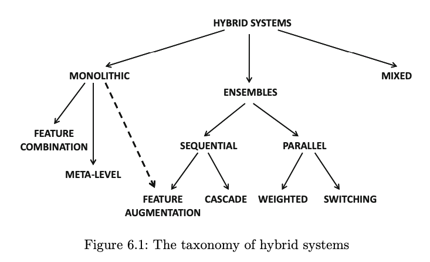
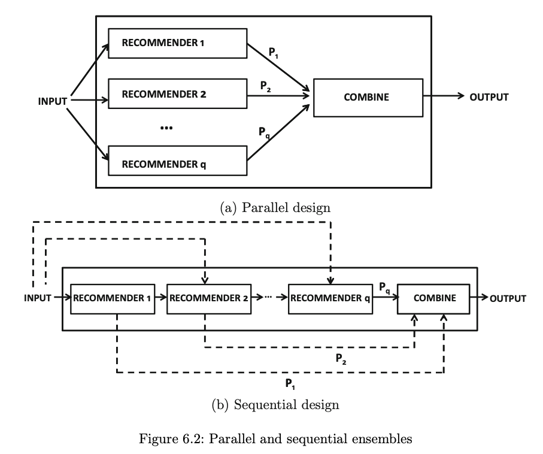

# 本書の紹介

本書『Recommender System:The Textbook』はレコメンデーション研究を総括したもの。

URL:https://rd.springer.com/content/pdf/10.1007%2F978-3-319-29659-3.pdf

ここでは、その6章である『Ensemble-Based and Hybirid Recommender Systems』を概説をまとめる。

-------

# 6.1 Introduction

[117]は複数のレコメンドアルゴリズムを組み合わせた手法を分類した。

### Weighted:

  複数のアルゴリズムの予測スコアを重みづけで統合して単一の予測結果を出力する。

### Switching:

  cold-start問題に対応するため、新規ユーザーには　knowledge-based recommender system　で表示を行い、データの蓄積するにつれ、content-basedやcollaborative recommender system で表示を行う。

### Cascade（数珠つなぎ）:

　いわゆるboosting。あるレコメンドの予測誤差を次のレコメンドアルゴリズムに渡して補正を行う。そのような連鎖したアルゴリズムを統合して、最終的には単一の予測結果を出力する。

### Feature augmentation:

　アルゴリズムの出力が、次のアルゴリズムに入力される特徴量となる。content-basedの予測値でレーティング行列の欠損値を埋めて、密になった行列でitem-basedを学習する、など。（Content-boosted CF)

### Feature combination:
 別のデータソースを統合して、一つのレコメンド手法として設計する。厳密にはアンサンブル手法とは言えない。

### Meta-level:
 例えば、content-based アルゴリズムを、同類グループ（peer group）を生成することに使い、最終的な予測や評価は別の評価マトリックスから同類グループを使って再度計算する手法。こちらも厳密にはアンサンブル手法とは言えない。

### Mixed:
　複数のアルゴリズムの推薦結果が、同時にユーザーに表示されるシステム。こちらもアンサンブル手法とは言えない。

[275]は上述の分類よりもさらに上位の分類として、 pararel system と sequential systemを定義した。

# 6.11 Bibliographic Notes

[117] はレコメンデーションのhybrid systemを整理した最初のサーベイ論文。

[118] はWeb利用におけるhybirid system の議論を行った。

[117] が行った分類をさらに掘り下げることで、[275]はpipelined systemとparallel systemに分類した。

レコメンドに限らず、広くアンサンブル手法についての議論は[22]が行い、主に判別問題においてアンサンブル手法のbias-varianceのトレードオフについて論じている。
アンサンブル手法の一般的な工夫であるBaggingとsubsamplingについては[111-113]が議論している。

Weighted ensembles のレコメンド手法は[311],[704]がある。
いずれもNetFlixPrizeの勝者である。
[180]はmaximum margin matrix factorization methodsを提案し、[338]はuser-basedとitem-basedを組み合わせた。

Switch hyblid system は[601]で議論された。
cold-start問題に対処するためのSwitchアプローチを[85]が議論し、[659]はknowledge-basedとcollaborative filterを組み合わせた手法を提案している。

----

# BIBLIOGRAPHY

[22] C. Aggarwal. Data mining: the textbook. Springer, New York, 2015

[111] P. Buhlmann. Bagging, subagging and bragging for improving some prediction algorithms, Recent advances and trends in nonparametric statistics, Elsivier, 2003.

[112] P. Buhlmann and B. Yu. Analyzing bagging. Annals of statistics, 20(4), pp. 927–961,
2002.

[113] L. Breiman. Bagging predictors. Machine learning, 24(2), pp. 123–140, 1996.

[117] R. Burke. Hybrid recommender systems: Survey and experiments. User Modeling and
User-adapted Interaction, 12(4), pp. 331–370, 2002.

[118] R. Burke. Hybrid Web recommender systems. The adaptive Web, pp. 377–406,
Springer, 2007.

[180] D. DeCoste. Collaborative prediction using ensembles of maximum margin matrix
factorizations. International Conference on Machine Learning, pp. 249–256, 2006.

[338] J.-S. Lee and S. Olafsson. Two-way cooperative prediction for collaborative filtering
recommendations. Expert Systems with Applications, 36(3), pp. 5353–5361, 2009.

[311] Y. Koren. The Bellkor solution to the Netflix grand prize. Netflix prize documentation,
81, 2009. http://www.netflixprize.com/assets/GrandPrize2009_BPC_BellKor.pdf

[704] http://www.the-ensemble.com/

[601] T. Tran and R. Cohen. Hybrid recommender systems for electronic commerce.
Knowledge-Based Electronic Markets, Papers from the AAAI Workshop, Technical
Report WS-00-04, pp. 73–83, 2000.

[659] M. Zanker and M. Jessenitschnig. Case studies on exploiting explicit customer requirements in recommender systems. User Modeling and User-Adapted Interaction,
19(1–2), pp. 133–166, 2009.

[85] D. Billsus and M. Pazzani. User modeling for adaptive news access. User Modeling
and User-Adapted Interaction, 10(2–3), pp. 147–180, 2000.
